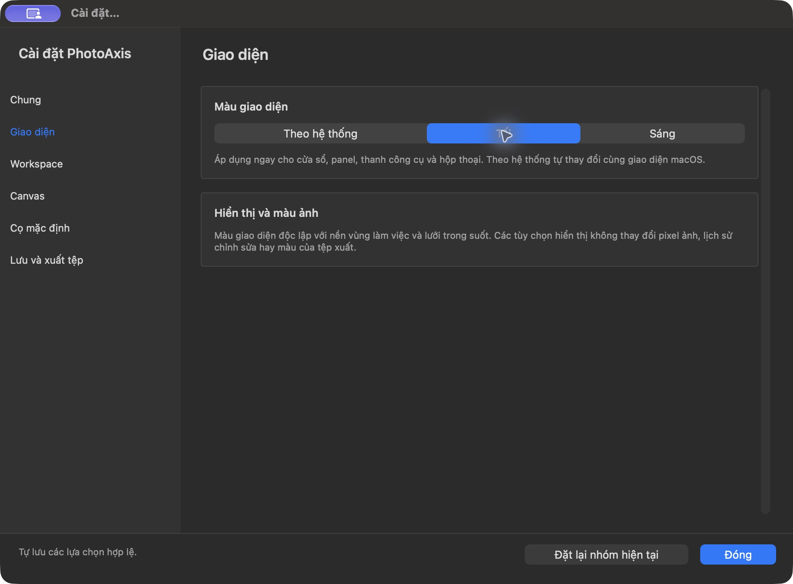
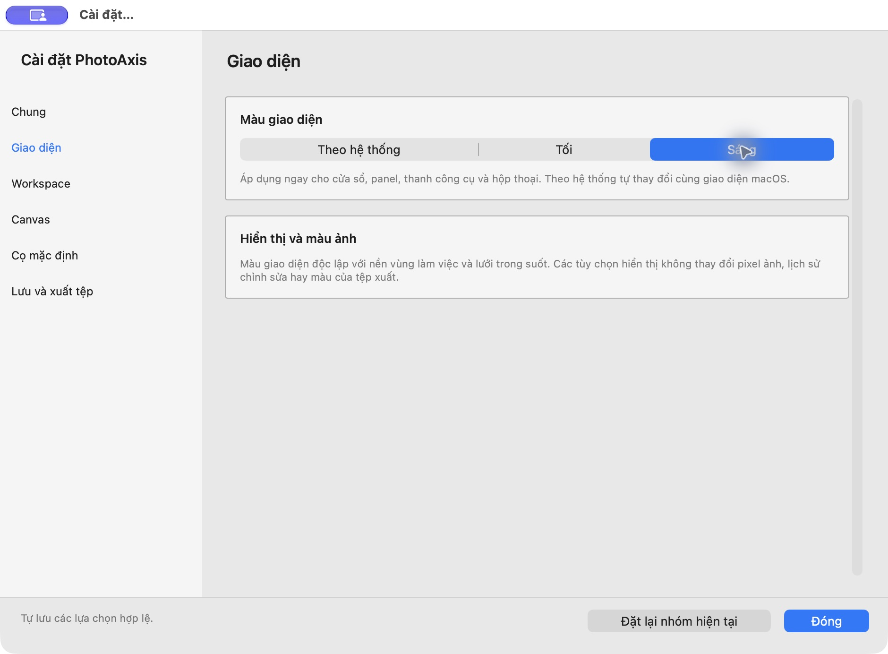

# Cài đặt và kiểm thử PhotoAxis — build 9, 04/10/2026

**DONE triển khai và kiểm local:** PhotoAxis1.0.0(9) có Cài đặt native sáu nhóm, chế độ **Tối / Sáng / Theo hệ thống**, tùy chọn lưu/xuất thực sự hoạt động, và hủy OCR. Đã chạy toàn bộ bộ kiểm tự động, benchmark riêng, Release native VI/EN và audit đầu ra. **Chưa đủ điều kiện installer public ổn định**; một FAIL local và các gate nghiệm thu vẫn còn.

## Cài đặt theo cách tổ chức Preferences của Photoshop

Danh mục bên trái, nội dung bên phải chia nhóm rõ ràng, cuộn theo trang; cửa sổ940×660pt, minimum window880×560pt, reset riêng nhóm và tự lưu các lựa chọn hợp lệ. Bố cục tham khảo [Adobe Photoshop Preferences](https://helpx.adobe.com/photoshop/desktop/get-started/settings-and-preferences/adjust-preferences.html), điều khiển và icon là AppKit/native của PhotoAxis, không lấy artwork Adobe.

| Nhóm | Tùy chọn có tác dụng |
| --- | --- |
| Chung | Ngôn ngữ VI/EN; version/build/kiến trúc/thông tin ứng dụng. Ngôn ngữ áp dụng sau mở lại |
| Giao diện | Theo hệ thống (mặc định), Tối, Sáng; áp dụng ngay cho cửa sổ/panel/control/dialog, lưu qua mở lại |
| Workspace | Bảng phải260–420pt, hiện/ẩn bảng, công cụ1/2cột, thước và đơn vịpx/mm/cm/in theoPPI |
| Canvas | Nền làm việc, lưới trong suốt, kích thước ô lưới; không đổi pixel/model/export |
| Cọ mặc định | Kích cỡ, độ cứng, độ mờ, Clone Aligned cho tài liệu mới; thêm bật/tắt vòng cọ trên canvas ngay, giữ con trỏ tool |
| Lưu và xuất tệp | Recovery10/30/60giây (luôn bật; từ lượt chờ kế tiếp), PNG/JPEG mặc định, JPEG1–100, giữ tỉ lệ; dùng cho hộp thoại Xuất được mở tiếp theo |

[Hướng dẫn Cài đặt](../HUONG_DAN_CAI_DAT.md). Không thêm tùy chọn GPU/Cloud/cache giả chưa có backend. Màu nền canvas độc lập theme; đổi theme không đổi lịch sử ảnh hoặc màu xuất. Các khóa cũ về workspace/canvas/cọ tương thích; dữ liệu sai có fallback an toàn. Reset nhóm không xóa hồ sơ hoặc nhóm khác.

## Lỗi đã debug và sửa

1. Startup ép darkAqua và surface/border dùng CGColor cố định khiến giao diện không theo macOS. Bỏ ép tối, thêm NSAppearance được lưu và màu động; refresh surface/border khi appearance đổi. Kiểm text/border/selected contrast và canvas độc lập bằng hosted tests, chụp theme thật trên Release.
2. Vision OCR cold có thể chờ lâu và panel bận không có cách hủy. Thêm **Hủy nhận dạng chữ** ở Phân tích, Task cancellation và `VNRequest.cancel()`, trả continuation đúng một lần, bỏ kết quả muộn trước mutation/audit. Một worker thực tế tối đa; khi macOS chưa dừng worker cũ, OCR mới báo đang bận, chỉnh sửa vẫn dùng được. [Apple VNRequest.cancel](https://developer.apple.com/documentation/vision/vnrequest/cancel()). Đây là sửa khả năng hủy/phản hồi, không tuyên bố đã giải quyết độ trễ model/runtime OCR mọi máy.
3. Trong kiểm Cài đặt, JPEG nhập sai từng chặn lưu cả recovery/định dạng/khóa tỉ lệ hợp lệ. Sửa giữ chất lượng đã lưu trước đó, hiện thông báo và vẫn lưu các lựa chọn độc lập. Test regression và native Release nhậpNaN→recovery30giây đều PASS.

Telex mô phỏng tiếp tục FAIL. Đã đổi dispatch test qua NSApp.sendEvent để đi qua app, vẫn trả raw `tieengs vieetj ` trên máy này. Không bỏ test hoặc ghi PASS giả; input source/native composition thật, VNI, EN, phím tắt và dấu vẫn cần kiểm bằng IME thật. Ca CUA gõ từng phím cũng không chứng minh nguồn nhập đang là Telex nên giữ riêng, không dùng kết luận lỗi production.

## Kết quả kiểm thử

| Kiểm | Kết quả và phạm vi |
| --- | --- |
| Toàn bộ `scripts/check.sh`, Xcode27/macOS27.0.1 | **210ca:206PASS/1FAIL/3SKIP**; lệnh test exit65 vì Telex.23CoreXCTest+33SwiftTesting+154AppXCTest |
| Kiểm mới | **9PASS**:7Cài đặt/appearance/persistence/export/minimum layout/reset/brush outline/validation độc lập;2OCRcancel/late result/no audit mutation |
| CI macOS15.7.9/Xcode16.4 | **210ca:205PASS/0FAIL/5SKIP**; Debug/test/ReleasePASS; skip3benchmark,Telexcontextkhôngcó,largeworkspace bị giới hạn desktop. [Run37162821992](https://github.com/nguyenduchai/PhotoAxis/actions/runs/37162821992) |
| Release build, ad-hoc verification, inventory | PASS, arm64/minOS14.0, productionENABLE_TESTABILITY=NO |
| Localization | PASS,564khóaVIEN khớp/453references |
| Release tooling policy | **16PASS** |
| Website | **12trangVIEN PASS**,links/metadata/assets/disabled download/no trackers |
| Benchmark opt-in riêng | **3PASS/0FAIL/0SKIP**, xem phạm vi và số liệu dưới |

Toàn suite phủ geometry/model/History/layers/crop/perspective/transform/text/shapes/adjustments/paint/scan/import/export/project/ZIP/quota/recovery/investigation/intake/audit/sharing/OCR/video/measurement/active-tab/cursor/workspace. Đây là toàn bộ bộ kiểm hiện có; không đồng nghĩa mọi thao tác A01–A43 hoặc mọi ảnh thực đã nghiệm thu. Core Image MDB_MAP_FULL và Metal/QoS warnings vẫn xuất hiện, chưa đóng qualification.

### Benchmark riêng

Máy M1Pro32GB/macOS27.0.1/Retina2×/Xcode27. Instrumented Release có UUID039B3474-A971-35B0-9D45-5771C6D220B2,codefd36432,ENABLE_TESTABILITY=YES. Chạy trước sửa Settings-only validation; renderer/model/lifecycle không đổi. App giao dùng Release cuối UUID7071B413...,testabilityNO. [Provenance](bang-chung/PREFERENCES-QA-20261004/benchmark-provenance.json).

- Open24MP median0,104s,p950,152s; PNG24MP export median0,384s,p950,491s.
- Mixed10layers worker100samples/tool: panmedian29,68ms/p9533,64ms/93%≤33,333ms; zoom28,58/32,56ms/99%; slider28,98/31,90ms/100%; **Perspective corner34,82/41,87ms/chỉ23%≤33,333ms**.
- Full quota5tab/40MP/50layer/120MPnguồn: recovery14,69s (goal30s), PNG40MP export1,463s; repeated lifecycle testPASS.
- Benchmark PASS là các ca hoàn tất và các assertion hiện có, **không đóng PERF-03**. Worker latency không phải FPS/native physical input-to-present; máy không phải M1/16GB theo baseline. Baseline19/43 giữ phạm vi build3 lịch sử.

## Kiểm native và audit đầu ra

Các file `final-*` thuộc **Release cuối**,6nhómVI và6nhómEN; System/Dark/Light đổi ngay, Dark giữ sau quit/relaunch. Native window940×660pt không thấy cắt nhãn/control. Resizeattempt native chưa thay geometry; minlayout880×538content chỉ PASS hosted ở cả VIEN/darklight; không tự nhận đã resize native tới minimum.

Native nhậpNaNquality→30giây hợp lệ→JPEG/linkoff→74; lần Export mới hiệnJPEG74/1600×640/72PPI/linkoff. ExportJPEG thực tế audit độc lập bằng Pillow:RGB8bit,sRGBICC,72PPI,khôngGPS,strokeđen hiển thị. Reopen `.paxis`schema4 hai layer, một brushstroke; ZIPCRC/hash/sourcebytes nguyên. So sánh trước/sau dùng ảnh đang mở vẫn hoạt động sau hủyOCR.

Native OCRApply có nút hủy; nhấn hủy→thông báo không ghi kết quả chưa hoàn tất, các nút phù hợp bật lại, reviewOCR vẫn disabled. CUAclick+observation554ms chỉ là thời gian điều khiển/quan sát, **không latency benchmark**. Lượt này không xác minh nhận dạng OCR cold hoàn tất; automated cancellation test chứng minh không mutation/late result và gateworker.

Các capture không có `final-` là prototype trước sửa qualityvalidation; Brushdrag/Undo/Redo/Save/cropCancel/ENreopen của prototype được giữ riêng. Không nhận chúng là rerun finalbinary. FinalRelease mở lại dự án đó và xuất mới. [Audit final](bang-chung/PREFERENCES-QA-20261004/native-final-audit.json), [quan sát](bang-chung/PREFERENCES-QA-20261004/native-final-observations.json), [phạm vi thư mục](bang-chung/PREFERENCES-QA-20261004/README.md).

## Provenance và phân phối

Compiled product codecommit `d9aad0cb8bec16394a56bd4fbdc734c55b98920a`; CI cùng codecommit. Sau compile chỉ website generator cập nhật số ca210/206, website và tài liệu/bằng chứng; Sources/Tests/Config/Fixtures/project không đổi. Compiledsourcefingerprint `d14b3484305d81d3f1ce055cddd90263c2b4bba26ba993ba63d894704ca7d8f3`; inventory sau website `6e37e03155d82dea9b682a5cbe42592140b0889ae455c14311c14a79a205c46d` sau đồng bộ website, parentcommitb182830. ReleaseUUID `7071B413-36F3-3955-B896-7BA783D2A75F`, executableSHA `9aaa89a3cf6f17f6bf8b11bda33a435b4d81903231f406e2a42408175e7639d7`, CoreSHA `92e1657577e1ab58ce1d28aca824cd7218dfad73aeb3b3894f39cc88fa5aa6a6`. QA VIEN bundle/name/signature riêng nên executableSHA riêng,UUID/Core khớp Release. [Buildmanifest](bang-chung/PREFERENCES-QA-20261004/build-manifest.json).

Mã nguồn GPLv3 và website public; ứng dụng giao localad-hoc, không DeveloperID/notarized. Website build9 mô tả đủCàiđặt/theme/OCRcancel và sốliệu kiểm, nút tải stable giữ disabled. DMG local đóng từ checkout sạch`434af6bc4db54ca69c8fa3b642d475bbef33f0e0`: SHA256`5954347044c83397ea0183ed2cc9a058598668a9cad6acf3a48d1da1cc8bc5aa`,2632676byte, mount/tree/codesign/GPL/SOURCE/detach/copyhashPASS. [Receipt](bang-chung/PREFERENCES-QA-20261004/delivery-receipt.json) và [manifest](../RELEASE_MANIFEST.md). [Pages proof](bang-chung/PREFERENCES-QA-20261004/pages-https.json):27resource HTTPS200/TLS/hash/commit75d446ePASS. Commit bổ sung receipt tài liệu được deploy/kiểm lại; proofHEAD cuối lưu ngoàiGit cùng bản giao để không tạo vòng lặp commitreceipt. Không tagstable/phát hành installerpublic khi `releaseReady=false`.

## Nội dung còn phải hoàn thiện để public

- FAIL Telex mô phỏng và nghiệm thu nhập thậtTelex/VNI/EN/composition/shortcut; toàn bộ A01–A43 chưa chạy lại build9 (19/43 chỉ build3).
- Máy/OSđích macOS14,non-Retina,M1-16GB; shortcut/layout/backgroundtasks/physicalinput-to-present và fullquota end-to-end. Perspectiveworker23% không đạt mục tiêu mẫu33,333ms, cần tối ưu và đo native.
- Đánh giá MDB_MAP_FULL/Metal-QoS, runtimeOCRVietnamese cold/warm trênOSđích. Cancel đã có nhưng modelinitlatency chưa chứng minh hoàn tất.
- Ảnhcamera/book/thin-stroke/Scan50trang, video/codec/clipdài có phép dùng, hiệu chuẩn đo/hình học thật; Paintpressure/tablet không thuộcPaint1, fullquota/input-to-present qualification vẫn mở.
- Danh tính nhà phát hành/namespace/Team/DeveloperID/notary, installerAccepted/stapled, Gatekeeper/cài sạch/nâng cấp/offline trênOSđích, artifact/tag/checksumpublic cuối.

Baseline9DONE/7BLOCKED_EXTERNAL/P16khi cần; các gateR01–R12 giữ mở. Không suy thành ứng dụng không còn bug từ CI xanh hoặc bộ kiểm mới PASS.
