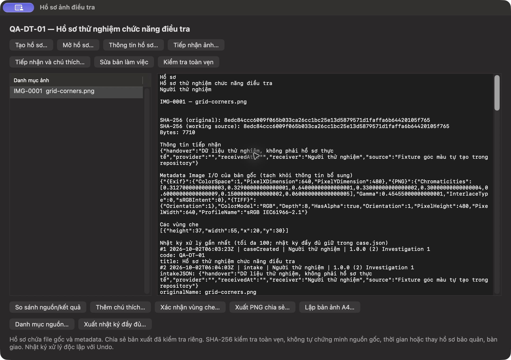
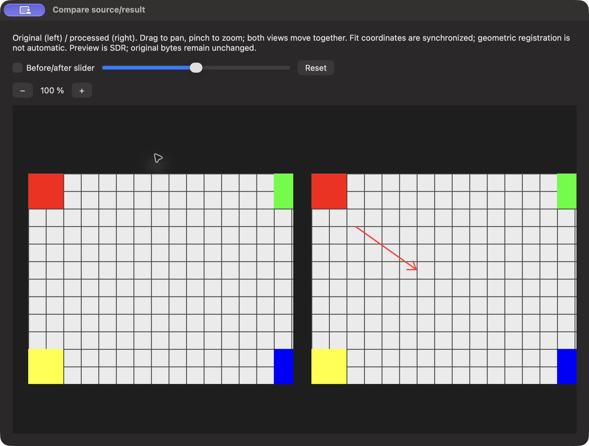

# Investigation 1 — triển khai gói phục vụ điều tra

Báo cáo này giữ bằng chứng **build2 lịch sử**. Bản hiện hành build3 đã bổ sung cả OCR/video/đo có hiệu chuẩn; xem [Investigation2](MO_RONG_DIEU_TRA.md) và [tổng tiến độ/public](TONG_TIEN_DO_VA_PUBLIC_2026-10-02.md). Các số test/UUID/ảnh và nhận định “chưa triển khai” dưới đây chỉ thuộc thời điểm build2.

Ngày 02/10/2026. **DONE trong phạm vi phát triển và kiểm chứng local I01–I10** của ba nhóm ưu tiên đã được người dùng giao: bảo toàn nguồn/truy vết; quản lý bộ ảnh/chú thích/so sánh; bản ảnh A4/chia sẻ đã rà soát. App **PhotoAxis 1.0.0 (2)**, native/offline; baseline 1.0-draft.3 giữ nguyên. Đây không phải xác nhận R02 hoặc chứng nhận công cụ giám định. Public vẫn `releaseReady=false`.

## Đầu ra đã triển khai

| ID | Chức năng | Bằng chứng và phạm vi PASS local |
| --- | --- | --- |
| I01 | File tiếp nhận đúng byte riêng, SHA-256, quyền0444 | Nhập fixture native; Python đối chiếu 7.710 byte với nguồn repository, hash `8edc84cc…05f765`; test phát hiện nguồn bị sửa ngoài app |
| I02 | Bản làm việc `.paxis` riêng | Bản gắn hồ sơ schema2, tài liệu thường vẫn schema1; ảnh8100×2 được giảm riêng cho working trong test, raw nguồn giữ đúng byte. Archive intake chuẩn hóa được giữ để phục hồi Delete → Save → Undo |
| I03 | Hồ sơ/tiếp nhận/metadata nguồn | Native mã/tên/người xử lý, nguồn/người cung cấp/người nhận/thời điểm/bàn giao; sửa thông tin có trước/sau trong log. Metadata Image I/O của raw source tách trường bổ sung; test GPS/ghi chú riêng tư vẫn nằm trong raw source sau resize |
| I04 | Log bền vững độc lập Undo | Commit/Undo/Redo/Save/Discard/intake/review/verify/export ghi manifest; mở lại Undo rỗng, log còn. Native Undo/Redo trước Save và lượt VI→EN→VI; đối chiếu độc lập toàn chuỗi35event và state digest cuối |
| I05 | Danh mục theo hồ sơ | ID/mã IMG ổn định, chọn ảnh/mở working/sửa intake/chú thích; xuất JSON nguồn native với receipt hash |
| I06 | Chú thích typed | Mũi tên3shape, ellipse, số, chữ, magnifier dùng cùng source/ROI/clip; Core test giữ source/clip/type và một command. Native VI thêm mũi tên, Undo/Redo/Save, EN mở lại giữ nội dung tiếng Việt |
| I07 | So sánh nguồn/kết quả | Native VI/EN cửa sổ đôi, −/+ zoom, kéo/cuộn pan, swipe, Reset. Binary cuối: pan cả hai ảnh cùng50×30pixel ảnh chụp; zoom125%, swipe0.35, Reset100%. Pinch có implementation/hosted kiểm guard, chưa nghiệm thu trackpad vật lý |
| I08 | Chia sẻ đã rà soát | Gắn vùng che với hash model, đổi model từ chối review cũ; native từ chối xuất khi chưa review. PNG cuối640×480 có đủ2.035pixel ROI20,30,55,37 đen đục; nguồn không đổi. GPS/UserComment/DateTime nguồn không chuyển sang PNG; EXIF output tối thiểu do Image I/O tạo được whitelist |
| I09 | PDF A4 | Native CG/Core Text1/2/4 ảnh/trang, caption/mã/hash/footer; test5plate ra5/3/2trang, English streaming và từ chối chữ quá dài. Đã render/xem14trang VI/EN gồm fixture và output native. PDF cuốiA4, một raster1240×1754 mỗi trang, không selectable text/font/annotation/file nguồn nhúng |
| I10 | Ghi và giới hạn đường vòng | Single writer lock, manifest atomic trước model commit; fault ENOSPC/EACCES giữ state/history/checkpoint. Save lỗi receipt giữ archive cũ, không false-saved. Chặn Save As/Place/Clipboard/Export thường và đích trong package; working mở riêng khóa sửa/xuất. Quit hai tab Cancel không bỏ chỉnh sửa trước đó |

`.paxcase` chứa file nhận, archive working và case.json/log. Chia sẻ PNG/PDF tạo file riêng bên ngoài package, ghi trên worker utility. Bản gốc và metadata không bị sửa theo vùng che. Nhật ký/danh mục/working archive vẫn có thể chứa thông tin riêng tư; không dùng chúng như output đã che.

## Mã nguồn và format

- Core: [InvestigationCase](../../Sources/PhotoAxisCore/Investigation/InvestigationCase.swift), [InvestigationAnnotations](../../Sources/PhotoAxisCore/Investigation/InvestigationAnnotations.swift).
- App: [CaseStore](../../Sources/PhotoAxisApp/Investigation/InvestigationCaseStore.swift), [Controller](../../Sources/PhotoAxisApp/Investigation/InvestigationController.swift), [Sharing](../../Sources/PhotoAxisApp/Investigation/InvestigationSharing.swift), [Comparison](../../Sources/PhotoAxisApp/Investigation/InvestigationComparison.swift).
- Tích hợp PhotoDocument/DocumentCoordinator/AppDelegate; UTI `.paxcase` và Finder routing. Profile2 ngăn reader cũ coi working có hồ sơ như tài liệu thường. Thêm69cặp khóa vi/en; tổng367khóa/314tham chiếu đã kiểm.
- [Đặc tả I01–I10](../DAC_TA_GOI_DIEU_TRA.md), [hợp đồng `.paxcase`](../DINH_DANG_PAXCASE.md), [profile `.paxis`](../DINH_DANG_PAXIS.md), [hướng dẫn](../HUONG_DAN_DIEU_TRA.md), ADR-021 trong [quyết định kỹ thuật](../QUYET_DINH_KY_THUAT.md).

## Kiểm thử và provenance

```sh
bash scripts/check.sh
bash scripts/build.sh Release
python3 scripts/generate-project.py --check
python3 scripts/check-localization.py
python3 -m unittest discover -s Tests/ReleaseTooling -v
python3 scripts/release-audit.py preflight
```

Full suite cuối: **130 PASS / 0 FAIL / 4 SKIP**,134test, gồm43Core và91AppKit (87App PASS/4SKIP). Gói này thêm17test:5Core/12AppKit. [Summary](bang-chung/INVESTIGATION/test-summary.json), [log](bang-chung/INVESTIGATION/debug-test.log). SKIP là Telex thực và3benchmark opt-in; benchmark3PASS trước đó là bằng chứng renderer lịch sử, không nhận như đo quota gói điều tra lần này.

Release **BUILD SUCCEEDED**, codesign local `--verify --deep --strict` PASS; arm64/minOS14.0/build2. Host M1Pro32GiB, Retina2×, macOS27.0.1, Xcode27.0Build27A266a. Xcode `-runFirstLaunch` đã hoàn tất sau lần assessment bị exit69; suite hiện tại thực sự chạy được. Không thay global xcode-select và không chấp nhận EULA thay chủ máy.

| Provenance bản cuối | Giá trị |
| --- | --- |
| Code commit | `826bebf61c068ca1864fdf8a20f6b410ca13aa2f` |
| Source dirty lúc build | false; sau build chỉ cập nhật tài liệu/bằng chứng |
| Source fingerprint SHA-256 | `096a5a9f2a7f0f8475ee855bcc58af4e98518b289db228f96855d5a25f294317` |
| Release UUID | `12159300-9A9E-32E9-8A06-08297E444A0B` |
| Executable SHA-256 | `af5d183cdc7f55256736d8eb4468f40348fb8231472bf6daf8e173c979a946a7` |
| Core SHA-256 | `aa75aef238cc69a8ad5c989560aad3b5627c8bf5623f9b1c22898a60e4a9a3ec` |

[Build manifest](bang-chung/INVESTIGATION/build-manifest.json), [Release log](bang-chung/INVESTIGATION/release-build.log), [binary verification](bang-chung/INVESTIGATION/binary-verification.log). QA bundles VI/EN dùng `ditto`, đổi bundle ID riêng và ký lại ad-hoc; UUID và Core đúng bản cuối. Executable SHA khác sau ký lại, ghi riêng trong manifest, không coi byte toàn bundle giống bundle thường.

16policytests PASS, gồm từ chối artifact build1 nếu config hiện build2. Preflight public vẫn trả BLOCKED_EXTERNAL/publicReadyfalse, exit2 dự kiến, không thực hiện publish. [Readiness](../READINESS_PUBLIC.json) và [candidate](../RELEASE_CANDIDATE.json) đã cập nhật provenance build2; DMG D54/website gallery build1 giữ đúng vai trò lịch sử, không nhận có gói điều tra.

## Native và kiểm tra đầu ra

Dùng duy nhất dữ liệu tự tạo `Fixtures/P02/grid-corners.png`, intake ghi rõ không phải hồ sơ thật. Tạo hồ sơ native VI, thêm mũi tên, Undo/Redo, Save và rà soát. Bản cuối mở EN/Save/export PDF, thoát để nhả lock, mở VI/verify/export PNG/log. [Nhật ký QA](bang-chung/INVESTIGATION/native-qa.txt) tách các binary trước/sau sửa, không gán ảnh cũ cho UUID cuối.





[Kiểm tra độc lập đầu ra cuối](bang-chung/INVESTIGATION/verified-artifact-inspection.json): rawbyte/hash/0444; archive hashes;35event nối hash và current state digest;4file xuất khớp receipt. Log export chứa34event, completion của chính việc export nằm ở event35 trong case, không thể tự nhúng receipt của file vào chính file ấy. Event9/11 bắt đầu nhưng không hoàn thành được giữ nguyên là lịch sử từ chối/chưa có receipt. Không xóa hoặc biến chúng thành thành công.

[PNG cuối](bang-chung/INVESTIGATION/verified-reviewed.png), [PDF native EN cuối](bang-chung/INVESTIGATION/verified-English-A4.pdf), [catalog](bang-chung/INVESTIGATION/native-source-catalog.json), [PDF4ảnh fixture](bang-chung/INVESTIGATION/fixture-A4-4.pdf). [Kiểm cấu trúc PDF các bố cục](bang-chung/INVESTIGATION/pdf-layout-inspection.json) ghi rõ source b350a77 trước sửa retention; code layout không đổi sau đó, suite cuối kiểm lại mọi bố cục. Đã dùng Poppler/pypdf/Pillow để render/xem từng trang và kiểm cấu trúc/pixel. Không chỉ kiểm PDF có mở được.

Hồ sơ, full log và các app QA ở `$BUILD_ROOT/QA/Investigation` ngoài Git. Full log byte gốc không đưa vào Git vì các event thử Save Panel sớm chứa đường dẫn máy; không chỉnh nội dung log để làm hash giả. Screenshot/AX trong Git chỉ dùng dữ liệu thử; text AX chuẩn hóa đường dẫn local. Build root: `~/Library/Developer/PhotoAxisBuilds/83990cd22abb`.

## Lỗi đã phát hiện và sửa

1. Assertion PNG ban đầu giả định không có bất kỳ EXIF; Image I/O tạo ColorSpace/dimensions output. Đổi kiểm đúng whitelist tối thiểu, vẫn từ chối GPS/thời gian/ghi chú nguồn; suite sau đó PASS.
2. Native ghi output từ main thread bị chặn trong `open()` với đích Documents/provider ở ca QA. Stack sample xác nhận mainthread I/O; chưa quy nguyên nhân cho OS. Chuyển ghi output sang worker utility, xuất lại trên ổ local PASS. Một lỗi chọn file QA dán absolute path vào ô tên bị Save Panel đổi dấu `/` thành `:`; hướng dẫn đã phân biệt ô tên và Go To Folder. Chỉ di chuyển/dọn file do QA tạo, không sửa file cá nhân.
3. Drag comparison dùng deltaX/Y không di chuyển với sự kiện CUA. Chuyển sang vị trí con trỏ liên tiếp; test hosted locations và native pointer cuối cùng50×30pixel PASS ở cả hai view.
4. Delete → Save → Undo rồi mở lại thiếu source trong checkpoint đã xóa layer. Giữ archive intake chuẩn hóa, kiểm hash và bổ sung assets khi current model cần; regression render/snapshot/dirty-state PASS. Đầu ra model đã lưu trước lỗi receipt vẫn không bị gắn saved giả.

## Giới hạn chưa kiểm chứng và bước sau

Chưa có nghiệm thu macOS14/non-Retina/M1-16GB, Telex/VNI vật lý, bộ100ảnh/10GiB/manifest32MiB/10.000event và native latency/RSS/GPU dài hạn. Lượt cuối vẫn có một warning QoS ở HDR ExportTests và console Metal MDB_MAP_FULL; giữ trong log, chưa khẳng định đã giải quyết. Manifest full-model có thể hết32MiB trước10.000event và I/O journal hiện serialized trong ngữ cảnh UI; dùng ổ local, báo lỗi khi không thể ghi tiếp. Không nhận bản này là kho bằng chứng chống sửa, có mã hóa, chữ ký hoặc timestamp tin cậy.

SHA-256 kiểm toàn vẹn theo giá trị ghi; không chứng minh nguồn gốc/thời gian/nội dung thật hoặc thay hồ sơ bảo quản/bàn giao. Vùng che chỉ có ý nghĩa với file PNG/PDF đã xuất và được kiểm lại. Không tự suy/cấp xác nhận dữ liệu thiếu trong intake. OCR tiếng Việt có xác nhận vùng nguồn, trích frame video và đo có hiệu chuẩn thuộc chặng mở rộng sau, chưa triển khai; AI tái tạo không có.

Bước tiếp theo là thử bộ ảnh được phép dùng theo quy trình thực tế và đo quota/thiết bị hỗ trợ, đồng thời đóng những ca A/R còn thiếu theo [ma trận](../MA_TRAN_NGHIEM_THU.md). Điều kiện public còn Developer ID/Team/namespace/notary, nghiệm thu máy đích/cài sạch, publisher/support/license/giá/target repository và website. Gói local không phụ thuộc các giá trị này để tiếp tục sử dụng thử.
