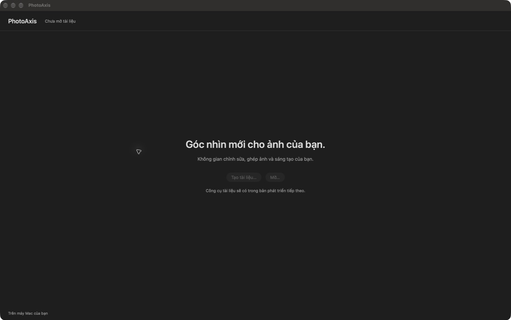
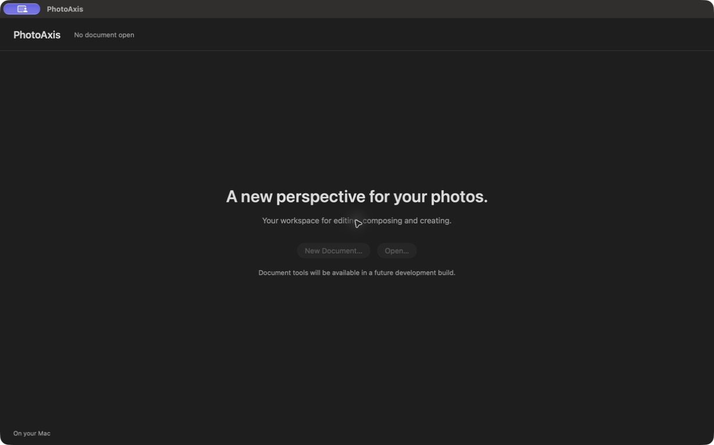

# P00 — Nền dự án PhotoAxis

**Trạng thái: DONE — 20/09/2026.** Hoàn thành phạm vi P00, chưa phải nghiệm thu PhotoAxis V1.0. Căn cứ `docs/prompts/00-khoi-tao-du-an.md` và đặc tả **1.0-draft.3** đã duyệt.

## Đầu ra mở được

- Project: [PhotoAxis.xcodeproj](../../PhotoAxis.xcodeproj), shared scheme **PhotoAxis**, app + core framework + Swift Testing bundle.
- App local đã mở: `/Users/admin/Library/Developer/PhotoAxisBuilds/83990cd22abb/DerivedData/Build/Products/Release/PhotoAxis.app`.
- Version **1.0.0**, build **1**, arm64, minimum OS **14.0**. Ký ad-hoc, không Team; chưa bật Hardened Runtime cho cấu hình local; không đủ điều kiện public.
- [Hướng dẫn build/test](../HUONG_DAN_BUILD.md), [kiến trúc](../KIEN_TRUC.md), [quyết định kỹ thuật](../QUYET_DINH_KY_THUAT.md), [fixture](../../Fixtures/README.md), [thành phần/license](../THANH_PHAN_VA_GIAY_PHEP.md).
- [Build manifest](bang-chung/P00/build-manifest.json) ghi source fingerprint, SHA-256 binary, đường dẫn app/xcresult. Source fingerprint SHA-256: `471b23844c40d712fbc8ffee1e8c96156e61c61e6b5b106e4cf514831f7340e8`.

Source đã kiểm tra nằm trong commit tạo P00 cùng báo cáo này. Xác định commit tại checkout bằng `git log -1 --format='%H %s' -- docs/bao-cao/P00.md`; mã commit được ghi trong bàn giao. Manifest cố định source/config/script và binary, không dùng hash báo cáo tự tham chiếu.

## Đầu vào và cấu hình thực tế

Đã đọc bối cảnh chung, P00, đặc tả, 43 ca nghiệm thu, tài liệu public, tiến độ và P01 để xác định ranh giới. Không tìm thấy AGENTS.md áp dụng trong repo hoặc các thư mục cha đã kiểm tra.

Git ban đầu: nhánh `main`, **chưa có commit**, **không remote**; README và docs là file chưa được theo dõi đã tồn tại trước khi triển khai. Không init/reset/xóa các tài liệu đó. Git author đã cấu hình, cho phép commit local; không suy ra danh tính public từ Git author. Không push/publish/tạo remote.

| Mục | Giá trị đo/đọc thực tế |
| --- | --- |
| Máy | MacBookPro18,3, Apple M1 Pro, CPU 10 lõi, GPU 16 lõi |
| RAM | 34,359,738,368 byte = 32 GiB |
| Hệ điều hành | macOS 27.0, build 26A428 |
| Màn hình | Built-in Liquid Retina XDR, 3024×1964, Retina |
| xcode-select toàn máy | `/Library/Developer/CommandLineTools` — giữ nguyên |
| Xcode dùng cho build | `/Applications/Xcode.app`, 27.0 (27A266a) qua DEVELOPER_DIR |
| Swift/SDK | Swift 6.4, language mode 6.0; macOS SDK 27.0 |
| Cấu hình | Debug `-Onone`, Release `-O`, deployment 14.0, ARCHS arm64 |
| Build root | `~/Library/Developer/PhotoAxisBuilds/83990cd22abb/` |

## Thực hiện và kết quả kiểm tra

| Kiểm tra | Kết quả | Bằng chứng |
| --- | --- | --- |
| Đọc inventory và project plist, shared scheme | PASS | `generate-project.py --check`, `plutil`; đầu [debug-test.log](bang-chung/P00/debug-test.log) |
| Bản dịch hiện có | PASS | 16 khóa khớp vi/en; plist hợp lệ; chưa đánh dấu A40 toàn bộ |
| Debug build và test Xcode | PASS | **6 passed / 0 failed / 0 skipped**, [test-summary.json](bang-chung/P00/test-summary.json), [debug-test.log](bang-chung/P00/debug-test.log) |
| Release build | PASS | [release-build.log](bang-chung/P00/release-build.log), `BUILD SUCCEEDED` |
| Binary/chữ ký local | PASS | `codesign --verify --deep --strict`, arm64, LC_BUILD_VERSION minos 14.0/sdk 27.0; [binary-verification.log](bang-chung/P00/binary-verification.log) |
| Mở app native | PASS | Debug đã mở; bản Release cuối mở lần lượt en/vi, có AX tree và ảnh dưới đây; tiến trình Release còn chạy sau kiểm tra |
| Cửa sổ/menu/disabled cơ bản | PASS trong phạm vi P00 | Native Welcome tối, text đọc được; New/Open/Save disabled, có tooltip; chưa có hành vi tạo/lưu giả. [Menu AX](bang-chung/P00/menu-vi-ax.txt) lấy từ Debug, menu source không đổi ở bản cuối |
| Vòng đời cửa sổ | PASS cơ bản | Cmd+W khi cửa sổ Debug có focus đóng được (`noWindowsAvailable`), chọn lại app mở lại cửa sổ; Cmd+Q kết thúc phiên thử, mở Release vi/en thành công. Chưa thử vòng đời tài liệu/dirty vì chưa có model tài liệu |
| Fixture tự tạo | PASS generator/metadata | 5 ảnh được sinh và đọc lại kích thước/orientation; thêm text Việt và PNG hỏng. [Log](bang-chung/P00/fixtures.log), [manifest](bang-chung/P00/fixture-manifest.json), [ảnh lưới](bang-chung/P00/fixture-grid-corners.png) đã xem trực quan đúng bốn góc |
| CI GitHub | CHƯA KIỂM CHỨNG | Workflow đã tạo, chưa có remote/run; không có quyền ghi release hoặc secret |
| Runtime macOS 14 / màn hình non-Retina | CHƯA KIỂM CHỨNG | Chưa có thiết bị để chạy; cấu hình deployment không thay thế kiểm tra máy thật |

Lệnh chính đã chạy từ gốc repo:

```sh
./scripts/check.sh
./scripts/build.sh Release
DEVELOPER_DIR=/Applications/Xcode.app/Contents/Developer xcrun swift scripts/generate-fixtures.swift
```

Lệnh hậu kiểm: `codesign --verify --deep --strict --verbose=2 <APP>`, `codesign -dv --verbose=2 <APP>`, `xcrun vtool -show-build <APP>/Contents/MacOS/PhotoAxis`, `xcresulttool get test-results summary --path <RESULT>`. Đường dẫn cụ thể ở build manifest. Các log đã thay đường dẫn repo/build bằng `<REPO>`/`<BUILD_ROOT>` và bỏ device ID khi xuất summary; không lưu credential/chứng thư/file cá nhân.

Test bundle dùng **Swift Testing**; dòng XCTest `Executed 0 tests` không phải kết quả cuối. Swift Testing và xcresult summary xác nhận **6 test thực**:

1. Chấp nhận 8000×5000 = 40 MP, từ chối quá diện tích/cạnh/Int.max/Int.min trước phép nhân; output phối cảnh tối thiểu 2 px.
2. Ghép ma trận `H × M`, giữ thứ tự crop sau mapping layer; layer mới identity.
3. Ma trận phối cảnh và inverse trả đúng bốn góc, bất biến theo scale homogeneous.
4. Từ chối matrix sai kích thước/suy biến/NaN và điểm trên đường kỳ dị.
5. Dịch 16,000 px vẫn khả nghịch, không nhầm độ lớn translation với suy biến.
6. Zoom 5%/100%/1600%, backing scale 1×/2× và pan: quy đổi round-trip đúng; scale 0 bị từ chối.

Đây là unit test nền cho F04/F08/F15; chưa phải engine homography solver, render, clip, hit-test hoặc kiểm thử nhập nguồn của các Axx.

## Ảnh native cuối





Ảnh lấy trực tiếp qua công cụ điều khiển ứng dụng native, không phải mockup/browser hoặc ảnh render lại từ HTML. [AX Việt](bang-chung/P00/native-vi-ax.txt) và [AX Anh](bang-chung/P00/native-en-ax.txt) xác nhận text và disabled. Công cụ đã co kích thước ảnh lưu (vi 1225×768, en 1229×768); **không dùng pixel screenshot để chứng minh kích thước window point**. Bản Việt đã dùng nút zoom cửa sổ native để toàn bộ cửa sổ nằm trong vùng chụp; ảnh chụp bị cắt trước đó không dùng làm bằng chứng cuối. P01 mới đối chiếu chính xác vi/en tại 1440×900, 1280×800, 1100×700 pt.

## Lỗi phát hiện và đã xử lý

| Mức ảnh hưởng khi phát hiện | Nguyên nhân chính xác | Xử lý và hậu kiểm |
| --- | --- | --- |
| Chặn build môi trường | Xcode chưa được chấp nhận license, xcode-select đang là CLT | Chủ máy xác nhận license; dùng DEVELOPER_DIR riêng; checkFirstLaunchStatus và xcodebuild đã chạy được |
| Chặn project | Generator dùng trùng ID logic cho PBXBuildFile và PBXFrameworksBuildPhase, Xcode báo `_setTarget:` / invalid buildPhases | Tách key, thêm guard duplicate; project parse và Debug/Release/test PASS |
| Chặn đường thử CLT | CLT 27 thiếu plugin TestingMacros khi thử SwiftPM | Bỏ đường fallback chưa hoạt động; chỉ giữ build/test Xcode, không thêm dependency vá môi trường |
| Chặn ký local | DerivedData trong Documents bị gắn `com.apple.FinderInfo` và File Provider metadata; codesign báo `resource fork, Finder information, or similar detritus not allowed` | Đưa build root sang Library ngoài File Provider; ký và verify app/framework PASS; không sửa metadata dữ liệu người dùng |
| Crash Release khi mở | DYLD library validation từ chối framework ad-hoc: `mapping process and mapped file (non-platform) have different Team IDs` khi Hardened Runtime bật | Dùng cấu hình local ad-hoc/runtime NO; rebuild Debug/test/Release, verify và mở app en/vi PASS. P13 phải Developer ID/runtime YES |
| Kích thước mở đầu | Gắn contentViewController làm window co về fitting size | Đặt lại frame 1280×800 sau khi gắn controller; không coi screenshot bị co là kiểm chứng kích thước P01 |

Warning còn lại của toolchain như bỏ qua AppIntents metadata (app không dùng AppIntents) hoặc không strip framework đã ký không làm build/test thất bại. Không có lỗi P00 đã biết còn chặn bàn giao. Gatekeeper/notarization/Hardened Runtime public chưa được kiểm chứng và không được đánh dấu PASS.

## Đối chiếu phạm vi và chặng tiếp theo

- F01: mới có nền AppKit/Welcome/menu/vi-en; A01/A02 và toàn bộ workspace còn P01. A03/A40 chỉ có bằng chứng một phần, không tick toàn ca.
- F04/F08/F15: có hợp đồng và kiểm thử geometry/dimension; A09/A14–A21/A35 vẫn chưa chạy end-to-end.
- F05/F12/F13/F14: đã đặt hợp đồng layer, command/undo, clip, `.paxis`, jobs và color; chưa có engine/lưu/xuất.
- R01/R03/R04: có cấu hình local và đầu vào còn thiếu; mọi Rxx vẫn chưa đạt public. Không public source/binary hoặc tạo remote.

**Tiếp theo P01 — Workspace native và khung Việt/Anh.** Có thể bắt đầu từ source hiện tại, không cần khởi tạo lại. P01 hoàn thiện bố cục, menu/tools/panels, trạng thái và focus, Settings ngôn ngữ; phải đối chiếu app thật ở ba kích thước quy định. Thông tin nhà phát hành/bundle ID/Team/repo/domain cần bổ sung ở các mốc ghi trong tài liệu public, không chặn P01.
