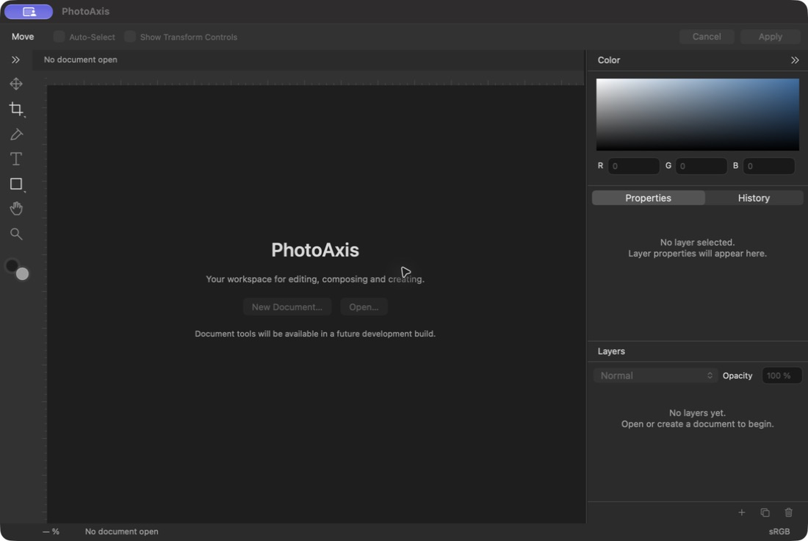
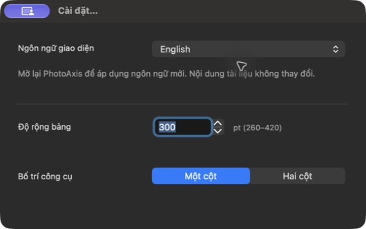
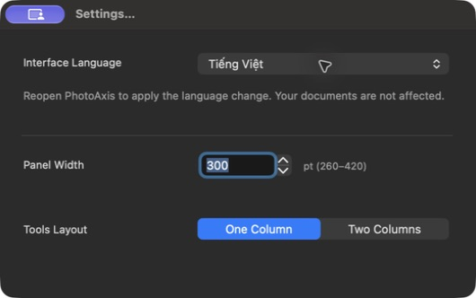

# P01 — Workspace native và khung Việt/Anh

**Trạng thái: DONE — 21/09/2026, trong phạm vi P01.** PhotoAxis **1.0.0 (1)**, đặc tả **1.0-draft.3**. Workspace AppKit chạy thật; chưa có tính năng chỉnh ảnh, lưu/xuất hoặc Perspective Crop hoạt động.

## Đầu ra và truy vết

- [Project Xcode](../../PhotoAxis.xcodeproj), shared scheme PhotoAxis, [hướng dẫn build](../HUONG_DAN_BUILD.md).
- App Release local: `/Users/admin/Library/Developer/PhotoAxisBuilds/83990cd22abb/DerivedData/Build/Products/Release/PhotoAxis.app`.
- [Build manifest](bang-chung/P01/build-manifest.json) ghi source fingerprint, binary SHA-256, toolchain, đường dẫn app và `.xcresult`. Lấy commit của chặng bằng `git log -1 --format='%H %s' -- docs/bao-cao/P01.md`; commit chứa cả source và báo cáo, tránh hash tự tham chiếu.
- [Kiến trúc](../KIEN_TRUC.md), ADR-007/008 trong [quyết định kỹ thuật](../QUYET_DINH_KY_THUAT.md), [checklist](../CHECKLIST_NGHIEM_THU_V1.0.md), [tiến độ](../TIEN_DO_TRIEN_KHAI.md).

Đầu vào đã xác minh: P00 tại `6625f0dc8534c7df12681d3977fc503c260b9430`, nhánh main, không remote; source fingerprint P00 và app nền đã kiểm tra trước khi thay đổi. Đã đọc bối cảnh chung/P01, đặc tả, checklist, public, mockup, kiến trúc và báo cáo P00. Không có AGENTS.md áp dụng được tìm thấy. Không tạo lại repository hoặc yêu cầu xác nhận lại đặc tả.

## Thay đổi thực tế — F01 và phần nền F15

1. Menu macOS đầy đủ các nhóm File/Edit/Image/Layer/Type/View/Window/Help, bản Việt tương ứng; tên cửa sổ/menu PhotoAxis. Settings/Reset/đổi layout/rulers/help là hành vi thật. New/Open/Place/Save/Save As/Export/Recovery và công cụ chưa có backend đều disabled; không dựng dữ liệu hoặc báo thành công giả. Save/Export/Recovery mới có điểm vào trong menu, chưa có form/engine.
2. Options Bar 36 pt, Tools 44/72 pt, tab bar 28 pt, rulers 20 pt, status 24 pt. Bên phải Color, Properties/History, Layers; mặc định 300 pt, giới hạn 260–420 pt. Chưa có document nên tên/zoom/dấu dirty/tab đóng và nội dung layer còn ở P02/P03; rulers chưa gắn số pixel giả.
3. Công cụ có vector native tự vẽ, tooltip tên/phím tắt và nhãn accessibility. Nhóm Crop/Shape mở NSMenu bằng click/nhấn giữ/chuột phải; các lựa chọn bên trong disabled. Tab Properties/History có trạng thái active. Control tùy biến có hover/pressed/focus; bằng chứng trực quan hiện có cho active/focus/disabled, lượt hover/pressed đầy đủ khi có backend vẫn ở nghiệm thu sau.
4. Thu gọn/mở lại panel, đổi một/hai cột, độ rộng qua divider/bàn phím/Cài đặt, bật/tắt rulers, Reset Workspace. UserDefaults lưu bố cục, kiểm tra dữ liệu hỏng/ngoài giới hạn. Reset giữ ngôn ngữ. Tab ẩn/hiện Tools và panel khi canvas có focus; không có monitor toàn app chiếm phím NSTextView.
5. Cài đặt Cmd+, có Theo hệ thống/Tiếng Việt/English; L10n bất biến trong phiên, preference áp dụng lần mở sau. Resolver chọn ngôn ngữ được hỗ trợ đầu tiên, English fallback. Có thông báo mở lại và không tự thoát. 114 khóa vi/en; kiểm tra được 112 tham chiếu tĩnh/khóa tool ghép. Ngôn ngữ không được thêm vào Core hoặc file tài liệu.
6. Tắt NSWindow automatic tabbing, dành thanh tab tài liệu cho P02. Icon phát hành chưa có; nhận diện hiện tại chỉ là tên PhotoAxis, không coi là app icon public đã duyệt.

## Cấu hình kiểm tra

Máy MacBookPro18,3, Apple M1 Pro, RAM 32 GiB, Retina 3024×1964/backing scale 2×. macOS 27.0 (26A428); Xcode 27.0 (27A266a), Swift 6.4/language mode 6, SDK 27.0. Giữ deployment macOS 14.0, arm64. Xcode dùng qua DEVELOPER_DIR riêng, không đổi xcode-select toàn máy.

Ký ad-hoc, Team rỗng, Hardened Runtime NO theo ADR-002 cho local. Các điều kiện Developer ID/notarization/Gatekeeper của bản public chưa được kiểm tra; không thay đổi bảo vệ hệ thống. Build nằm ngoài Documents/File Provider.

## Kiểm tra và bằng chứng

| Kiểm tra | Kết quả | Bằng chứng/phạm vi |
| --- | --- | --- |
| Inventory project, plist, vi/en | PASS | [debug-test.log](bang-chung/P01/debug-test.log), [kiểm tra dịch cuối](bang-chung/P01/localization-check.log); 114 khóa khớp, 112 tham chiếu hợp lệ |
| Debug build, Core + AppKit tests | PASS | **13 passed / 0 failed / 0 skipped**; [test-summary.json](bang-chung/P01/test-summary.json), log và `.xcresult` trong manifest |
| Release build | PASS | [release-build.log](bang-chung/P01/release-build.log) |
| Chữ ký/binary | PASS local | [binary-verification.log](bang-chung/P01/binary-verification.log): verify deep/strict, arm64/minos14.0; không đủ điều kiện public |
| Bố cục vi/en, 3 kích thước | PASS phần hiện có | 6 native PNG, [layout-measurements.json](bang-chung/P01/layout-measurements.json); đã xem trực quan cả sáu ảnh |
| Persistence và Reset | PASS | Hosted tests; trên Release đã lưu 392 pt/hai cột/thu gọn, quit/reopen giữ đúng, mở bảng đọc AX 392; Reset trở lại 300 pt/một cột, English vẫn giữ |
| Ngôn ngữ | PASS phần hiện có | Đổi bằng Settings vi→en và en→vi; không đổi ngay/không tự thoát; lần mở mới đổi UI; ảnh Settings và native AX bên dưới |
| Focus/keyboard | PASS phần hiện có | CUA click splitter và Left làm 392→400 pt, hiện focus ring; Tab canvas ẩn/hiện bảng; Tab trong ô số không ẩn; hosted test NSTextView |
| Flyout/history/disabled | PASS phần hiện có | Chuột phải Crop mở Crop/Perspective Crop disabled, [flyout AX](bang-chung/P01/flyout-en-ax.txt); History đổi nhãn rỗng; không chạy lệnh chỉnh sửa giả |
| Mouse hit-test/responder resize | PASS cấp component | Test kiểm tra hit-test cửa sổ, mouseDown nhận focus, mouseDragged chuyển tọa độ cửa sổ và resize tại 260/350/420 pt; clamp ngoài giới hạn |
| Kéo bằng WindowServer/chuột thật | CHƯA KIỂM CHỨNG end-to-end | Công cụ CUA trả `AXError.notImplemented` cho drag. Thử NSWindow.sendEvent trong host thất bại do `key=false, active=false`; kích hoạt host không thành công. Giữ [log chẩn đoán](bang-chung/P01/pointer-dispatch-unverified.log), không gọi component test là bằng chứng chuột vật lý |
| CI/macOS 14/non-Retina/IME | CHƯA KIỂM CHỨNG | Không remote/run CI, không máy macOS 14/non-Retina; Type và số thập phân chưa có |

Lệnh đã chạy:

```sh
python3 scripts/generate-project.py
./scripts/check.sh
./scripts/build.sh Release
```

Hậu kiểm bằng `codesign --verify --deep --strict`, `codesign -dv`, `xcrun vtool -show-build`, `xcresulttool get test-results summary`. Log đã thay repo/build root bằng ký hiệu, summary bỏ device ID. Không có credential/chứng thư hoặc file cá nhân trong bằng chứng.

Bộ 7 test AppKit bổ sung cho 6 test Core P00:

- Thứ tự hệ thống vi/en và fallback khi không hỗ trợ.
- Đổi ngôn ngữ chỉ áp dụng lần sau, thông báo/giữ cửa sổ, Reset không mất lựa chọn.
- Lưu/mở lại layout, Reset, preference hỏng/ngoài giới hạn.
- Hit-test/tọa độ mouse responder, clamp, accessibility increment/decrement, parse số sai, Settings refresh sau Reset.
- Tab qua NSWindow trên canvas và NSTextView; không chiếm sự kiện của ô nhập.
- Tool/flyout disabled, accessibility label và History switch.
- Layout native 3 kích thước × 2 ngôn ngữ, ảnh/đo point; component Perspective options ở rộng 600 pt dùng overflow, Apply/Cancel không bị che. Đây chưa phải phiên crop thực.

## Đối chiếu visual và sai khác

[Bộ tham chiếu cố định](../tham-chieu/P01/README.md) gồm ảnh workspace Adobe (trang cập nhật 05/06/2026) và mockup PhotoAxis cũ, ghi nguồn/hash. Đặc tả draft.3 là chuẩn khi mockup cũ khác ngôn ngữ/phạm vi. Ảnh Adobe không thuộc resource bundle hoặc sản phẩm phân phối.

| Kích thước window pt | Việt | English | Content view đo được trên máy này |
| --- | --- | --- | --- |
| 1440×900 | [PNG](bang-chung/P01/workspace-vi-1440x900.png) | [PNG](bang-chung/P01/workspace-en-1440x900.png) | 1440×868 pt, 2× |
| 1280×800 | [PNG](bang-chung/P01/workspace-vi-1280x800.png) | [PNG](bang-chung/P01/workspace-en-1280x800.png) | 1280×768 pt, 2× |
| 1100×700 | [PNG](bang-chung/P01/workspace-vi-1100x700.png) | [PNG](bang-chung/P01/workspace-en-1100x700.png) | 1100×668 pt, 2× |

Các ảnh trên lấy từ `NSView.cacheDisplay` trong cửa sổ native của test host, không gồm title bar; JSON đo cả frame cửa sổ. Title bar/chrome hệ thống làm content height khác window height. CUA chụp trực tiếp cửa sổ Release bổ sung dưới đây; công cụ có thể thu nhỏ ảnh, không dùng pixel đó để chứng minh point.








[AX Việt](bang-chung/P01/native-vi-ax.txt), [AX English](bang-chung/P01/native-en-ax.txt), [bố cục khôi phục](bang-chung/P01/restored-en.png), [AX 392 pt](bang-chung/P01/restored-en-ax.txt), [focus/History](bang-chung/P01/focus-history-en.png).

Sai khác đã đánh giá:

- Vùng Tools/Options/tabs/canvas và ba cụm bên phải bám tham chiếu; màu dùng đúng giá trị khởi điểm của đặc tả. Controls 11–13 pt, icon native sắc nét; chữ tiếng Việt không tràn/cắt dấu ở sáu ảnh. Logo chữ chào mừng 26 pt, không phải cỡ controls.
- Checkbox/popup/segmented/color well dùng hình thức native macOS 27, gồm ô màu tròn và góc bo; không giống từng pixel ảnh Adobe hoặc HTML mockup. Giữ hành vi/khả năng truy cập native, sẽ đối chiếu lại macOS 14 ở P12.
- Native Window menu và nhãn hành động hệ thống trong AX có thể theo ngôn ngữ macOS dù UI app là English; đây là nội dung hệ thống theo mục 4.3. Toàn bộ nhãn PhotoAxis cung cấp được dịch theo lựa chọn.
- Canvas chưa có ảnh, tabs/layers chưa có dữ liệu; không thêm ảnh giả chỉ để giống mẫu. Welcome/New và các menu Save/Export/Recovery biểu thị trạng thái chưa triển khai.
- Màu accent/focus phụ thuộc macOS; Properties/History active màu accent trong cửa sổ foreground, gray trong ảnh test khi host không active. Bằng chứng phân biệt hai trạng thái.

## Lỗi phát hiện và xử lý

| Mức ảnh hưởng | Phát hiện | Xử lý/kết quả |
| --- | --- | --- |
| Bố cục | NSStackView Welcome có width/height 0 khi dựng, sinh xung đột constraint dù ảnh sau layout trông đúng | Khởi tạo frame hợp lệ và orientation trước arranged subviews; lượt test cuối không còn conflicting constraints |
| Chất lượng kiểm tra | Scanner localization cũ chỉ tìm `L10n.text`, bỏ sót instance lookup | Scanner nhận `.text`, literal helper keys và ToolKind ghép, bỏ identifier kỹ thuật; guard số tham chiếu; 114/112 kiểm tra đạt |
| State UI | Settings đóng vẫn giữ NSTextView first responder, có thể bỏ qua refresh sau Reset | Chỉ giữ text khi cửa sổ đang visible/key và editing; test đóng Settings→Reset→mở lại đọc 300 |
| Tích hợp tab | AppKit tự thêm window tabbing cạnh thanh tab riêng | Tắt automatic tabbing và đặt `.disallowed` trên cửa sổ workspace/Settings; P02 quản lý document tabs |
| Giới hạn QA | Drag CUA không hỗ trợ; hosted NSWindow mouse dispatch không active/key | Giữ kết quả chưa kiểm chứng, kiểm tra hit-test/responder riêng và bằng chứng keyboard/Settings thật; chuột/trackpad vật lý cần P12 |

Warning toolchain còn lại: AppIntents metadata không dùng, framework đã ký không strip khi copy; macOS test host có thông báo dịch vụ `linkd.autoShortcut`/task port. Không có compile/test failure trong lượt kiểm tra cuối; log chẩn đoán dispatch thất bại được giữ riêng. Không tuyên bố các warning hệ thống này là lỗi engine ảnh vì chưa có engine.

## Đối chiếu nghiệm thu và bàn giao

A01–A03/A40–A42 được ghi **từng phần** trong checklist, chưa tick toàn ca. A01 cần document/tab/engine thật; A02 cần phiên công cụ và lượt pointer vật lý; A03 cần đủ hover/pressed/active/keyboard của tool; A40 cần hộp thoại tương lai; A41 cần quit tài liệu dirty; A42 cần Telex/VNI và locale số thập phân. A43 và Axx chỉnh ảnh/lưu/xuất chưa chạy. R01–R12 chưa đạt public.

Không có blocker phát triển P01 còn ngăn mở shell hoặc dùng Settings/layout. Giới hạn QA pointer/thiết bị/CI được giữ minh bạch, không chuyển thành PASS. App là bản phát triển ký ad-hoc; không push, tạo remote hoặc public.

**Tiếp theo P02 — Tài liệu, nhập ảnh, canvas, tab, zoom/pan.** Dùng source hiện tại, hợp đồng geometry/Retina/Core và preference đã có; đọc prompt P02. Backend các chặng sau mới mở dần lệnh đang disabled. Danh tính ký/domain/repository public chưa cần để bắt đầu P02.
