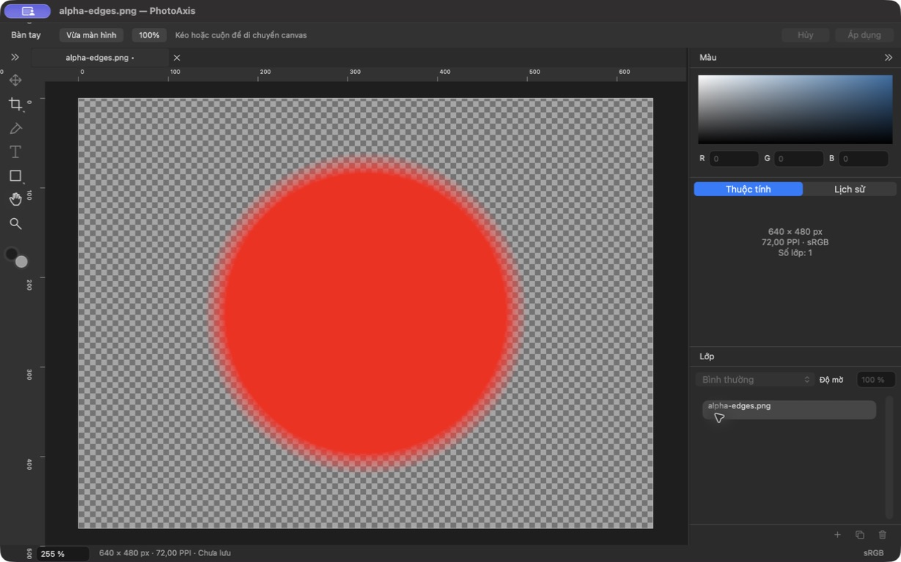
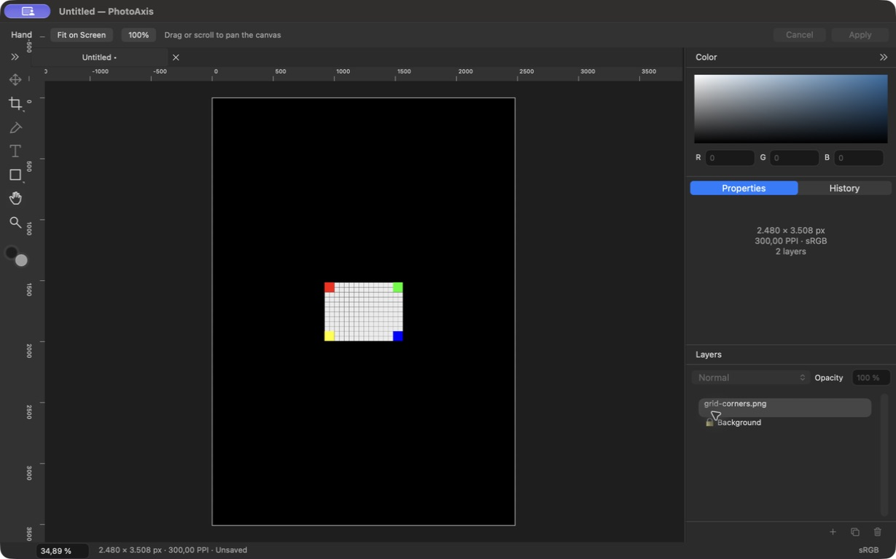
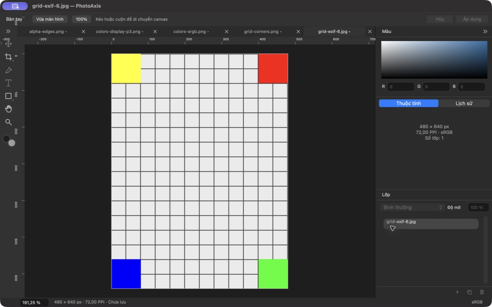

# P02 — Tài liệu, nhập ảnh, canvas và điều hướng

**Trạng thái: DONE — 23/09/2026, trong phạm vi P02.** PhotoAxis **1.0.0 (1)**, đặc tả đã duyệt **1.0-draft.3**. App native đã tạo tài liệu, nhập ảnh nhúng, quản lý 5 tab và hiển thị canvas bằng MetalKit/Core Image. Layer editing/Undo command thuộc P03; lưu `.paxis` thuộc P09. Các lệnh chưa triển khai vẫn disabled.

## Đầu ra và truy vết

- Tiếp nối P01 tại `4724a3f7542b0895f092010c4073ac629fe6d241`, nhánh `main`. Đã đọc bối cảnh chung, prompt P02, đặc tả, checklist, kiến trúc và bàn giao trước; không khởi tạo lại repository.
- [Project Xcode](../../PhotoAxis.xcodeproj), [hướng dẫn build](../HUONG_DAN_BUILD.md), [fixture tự tạo](../../Fixtures/P02), [kiến trúc](../KIEN_TRUC.md), ADR-009–011 trong [quyết định kỹ thuật](../QUYET_DINH_KY_THUAT.md).
- App Release: `/Users/admin/Library/Developer/PhotoAxisBuilds/83990cd22abb/DerivedData/Build/Products/Release/PhotoAxis.app`.
- [Build manifest](bang-chung/P02/build-manifest.json) ghi fingerprint source, SHA-256 binary/bằng chứng, toolchain và `.xcresult`. Commit local chứa source và báo cáo; lấy hash bằng `git log -1 --format='%H %s' -- docs/bao-cao/P02.md`. Không có remote, không push/public.

## Thay đổi thực tế — F02–F04, nền F05 và F15

1. Model có UUID ổn định, canvas/PPI, nguồn nhúng theo SHA-256, layer ảnh/chữ/hình có kiểu riêng, ma trận 3×3 và clip theo layer. Không flatten mô hình để dựng canvas. New nền trắng/đen tạo rectangle khóa; nền trong suốt không thêm layer. Renderer text/ellipse/line/clip chưa có ở P02 và từ chối rõ nếu nhận dữ liệu đó.
2. New hỗ trợ preset, kích thước tùy chỉnh, đổi chiều, PPI và nền; validation chặn số sai/ngoài giới hạn trước tạo. PNG/JPEG/HEIC tĩnh qua Image I/O, EXIF orientation được chuẩn hóa; alpha được giữ, pipeline 8-bit SDR sRGB. P3 được chuyển màu, RGB không profile giả định sRGB, depth cao được thông báo chuyển SDR. APNG/nhiều ảnh, TIFF file và các định dạng ngoài phạm vi bị từ chối; TIFF clipboard tĩnh được chuyển thành PNG nhúng.
3. Open tạo tab; Place Embedded vào tài liệu đang chọn; canvas drop/paste vào tài liệu, tab bar drop mở tài liệu mới. Nhiều file xử lý tuần tự, báo lỗi riêng và giữ file đã nhập thành công. Layer mới nằm trên layer được chọn, căn giữa, thu nhỏ vừa canvas khi cần, không tự phóng lớn.
4. Kiểm tra 8000 px/cạnh, 40 MP/canvas hoặc nguồn, 50 layer, 120 MP nguồn duy nhất và 5 tab. Probe metadata trước decode lớn; resize cần lựa chọn rõ. Nhập ảnh sở hữu bản sao bytes bất biến, không dùng file mapping và không ghi ảnh gốc. Thay file ngoài ứng dụng không làm đổi nguồn đã nhúng. Commit vào model tái kiểm tra quota; đóng tab đích trong lúc nhập không chuyển ảnh sang tab khác.
5. Mỗi PhotoDocument giữ model, viewport, selection, active tool, chỗ chứa tool session và UndoManager riêng. DocumentCoordinator là nơi duy nhất quyết định close/quit; không đăng ký thêm vòng đời với NSDocumentController. Close-all hỏi trước toàn bộ; Cancel giữ tất cả tab. Tab có dấu chưa lưu, Cmd+W đóng tab đang chọn. Save disabled và lời giải thích đúng tình trạng P09.
6. Canvas có checkerboard, rulers theo pixel tài liệu, Hand/Space/scroll/pinch, Zoom quanh con trỏ, Fit/100%, nhập zoom 5–1600%. 100% dùng pixel thiết bị; pan/zoom không làm dirty hoặc thêm Undo. Parser zoom/PPI theo vùng macOS, độc lập ngôn ngữ UI.
7. ImagePipeline actor giải mã/chuyển màu/evaluate preview ngoài MainActor; MTKView trình bày bitmap viewport. ID/revision/generation loại frame cũ sau đổi tab. Viền canvas dùng viewport của frame đang hiện. Có hủy nhập và cache decoded LRU 256 MiB, thu hồi nguồn của tab không hoạt động. Đây là giới hạn cache, không phải giới hạn tổng RAM.
8. **158 khóa Việt/Anh**, scanner kiểm tra 152 tham chiếu tĩnh/ghép. Hand/Zoom, New/Open/Place hoạt động; Move/Crop/Type/Shape chỉnh sửa, Save/Export và các thao tác Layers chưa có backend giữ trạng thái disabled với lý do.

## Cấu hình và kết quả kiểm tra

Máy MacBookPro18,3, Apple M1 Pro, RAM 32 GiB, Retina 3024×1964/backing 2×; macOS 27.0 (26A428), Xcode 27.0 (27A266a), Swift 6.4/language mode 6, SDK 27.0. Deployment vẫn macOS 14.0, arm64. Build/test nằm ngoài Documents; DEVELOPER_DIR riêng, không đổi xcode-select hay quyền bảo vệ hệ thống. Ký ad-hoc local, chưa Developer ID/notarization.

| Kiểm tra | Kết quả | Bằng chứng và phạm vi |
| --- | --- | --- |
| Inventory project/plist/localization | PASS | [project-check.log](bang-chung/P02/project-check.log), [localization-check.log](bang-chung/P02/localization-check.log); 158 khóa/152 tham chiếu |
| Debug build và test | PASS | **27 passed, 0 failed, 0 skipped** = 10 Core + 17 AppKit; [summary](bang-chung/P02/test-summary.json), [log](bang-chung/P02/debug-test.log); lượt cuối không có runtime warning trong xcresult |
| Release build | PASS | [release-build.log](bang-chung/P02/release-build.log) |
| Chữ ký/binary | PASS local | [binary-verification.log](bang-chung/P02/binary-verification.log); verify deep/strict, arm64/minos14.0, QA bản sao cùng UUID code |
| Unicode/EXIF/alpha/nguồn bất biến | PASS | Hosted tests kiểm tra bytes trước/sau, sửa file ngoài ứng dụng, bốn góc EXIF, alpha 0/1/bán trong suốt; [EXIF đã chuẩn hóa](bang-chung/P02/exif-normalized.png), [alpha](bang-chung/P02/alpha-normalized.png) |
| P3/sRGB/grayscale/depth/HEIC | PASS phần nhập với fixture | Oracle ColorSync qua NSColor độc lập đối chiếu P3; HEIC tự sinh, gray 16-bit, RGB bỏ profile; [P3→sRGB](bang-chung/P02/p3-to-srgb.png). HDR gain map thực còn chưa kiểm chứng |
| Lỗi/giới hạn/hủy | PASS phần nền | File hỏng/TIFF/APNG, 8001×1 có consent, 10k pixel budget, 50 layer/120 MP dedup, tab 6; batch lỗi riêng, tab đích đóng, cancellation và cache reclamation. Không thay cho stress 40/120 MP thực |
| New/preset/locale | PASS phần hiện có | Hosted tests 4 preset vi/en, swap, PPI, số sai/overflow, zoom dấu phẩy/chấm theo vùng; native New 1080² trắng, A4 2480×3508/300 PPI đen và chiều rộng 8001 bị chặn |
| Native import/tabs/Place | PASS phần hiện có | Open panel, 5 tab, chọn tab, lỗi file riêng và vượt tab; Place ảnh 640×480 vào A4 giữ tỷ lệ/căn giữa trên nền khóa; ảnh/AX bên dưới |
| Zoom/pan/overlay | PASS phần hiện có | Native 100%, Fit, nhập 12,5%, scroll pan; Core anchor/backing đổi 1×/2×; test render đối chiếu màu tại tọa độ thiết bị sau pan; [1×](bang-chung/P02/render-grid-1x.png), [2×](bang-chung/P02/render-grid-2x.png). Hosted test Space/mouse responder, chỉ frame tab cuối được trình bày |
| Clipboard/drop | PASS component; chưa đủ end-to-end | Test private NSPasteboard PNG/file URL và định tuyến, không sửa clipboard người dùng. Callback drop đã nối canvas/tab bar. Kéo file từ Finder và clipboard liên ứng dụng bằng pointer thực chưa kiểm chứng |
| Close/quit | PASS phần P02 | Native Cancel giữ 2 tab, Don’t Save hỏi lần lượt 2 tài liệu thử rồi thoát; không còn hộp thoại review thứ hai của NSDocumentController. Save vẫn disabled |
| Layout hồi quy P01 | PASS phần shell | 7 test P01 vẫn qua; [đo layout](bang-chung/P02/layout-measurements.json) là workspace rỗng vi/en ở 1440×900, 1280×800, 1100×700 pt, không phải đối chiếu đủ mọi tài liệu/phiên công cụ |
| Pinch/chuột vật lý/non-Retina/macOS 14/CI | CHƯA KIỂM CHỨNG | Không có thiết bị phù hợp hoặc khả năng drag native của công cụ. Backing 1× trong test không thay máy non-Retina thực |
| Benchmark/stress và luồng Save/Export | CHƯA KIỂM CHỨNG | Không tuyên bố FPS, open dưới 3 giây, tổng RSS hay A36/A37 đạt; Save/Export là P09/P10 |

Lệnh thực chạy:

```sh
python3 scripts/generate-project.py
python3 scripts/generate-project.py --check
python3 scripts/check-localization.py
./scripts/check.sh
./scripts/build.sh Release
```

Hậu kiểm dùng `xcresulttool get test-results summary`, `codesign --verify --deep --strict`, `vtool -show-build` và `dwarfdump --uuid`. Log lưu trong Git thay repo/build root/thư mục tạm bằng ký hiệu và bỏ khoảng trắng cuối dòng; summary bỏ device ID. Fixture nhỏ được nhúng **chỉ vào test bundle**, Cmd+U/CLI không phụ thuộc quyền đọc Documents; ảnh sinh thêm/output test ở build root.

## Kiểm tra native

Ảnh ngày 22–23/09 lấy trực tiếp cửa sổ AppKit, không dùng mockup. Các bản QA sao từ Release có bundle ID riêng để không ảnh hưởng tài liệu/preference phiên dùng thật; chỉ mở fixture tự tạo. `alpha-final-vi.png`, `five-tabs-final-vi.png`, hộp thoại lỗi và AX tương ứng là bản Release cuối. Các ảnh trước đó giữ bằng chứng từng thao tác; sau ảnh English đã sửa nhãn `1 layers` thành `Layers: 1` và tên menu Close cho đúng ngữ cảnh tab. Source ứng dụng không đổi thêm sau chỉnh hai nhãn này; thay đổi cuối ở test chỉ chuyển tạo fixture HEIC ra nền.







- New: [nền trắng](bang-chung/P02/new-white-vi.png), [số sai bị chặn](bang-chung/P02/new-invalid-vi.png), [A4 English](bang-chung/P02/new-a4-en.png).
- Điều hướng: [100%](bang-chung/P02/grid-100-vi.png), [scroll pan](bang-chung/P02/qa-grid-pan-vi.png), [zoom 12,5%](bang-chung/P02/zoom-decimal-vi.png). Ảnh pan có viền trắng do công cụ capture lúc đổi kích thước; toàn bộ canvas thấy được, không dùng ảnh này để suy ra point/window frame.
- Import/close: [batch lỗi và tab limit](bang-chung/P02/batch-error-limit-vi.png), [đóng tab Việt](bang-chung/P02/close-cancel-vi.png), [quit English](bang-chung/P02/quit-cancel-en.png), [AX sau Cancel vẫn còn hai tab](bang-chung/P02/quit-cancel-preserves-tabs-en.ax.txt).
- AX: [bản cuối tiếng Việt](bang-chung/P02/alpha-final-vi.ax.txt), [Place A4 English](bang-chung/P02/place-a4-en.ax.txt), [5 tab bản cuối](bang-chung/P02/five-tabs-final-vi.ax.txt). [Nhật ký QA](bang-chung/P02/native-qa.txt) phân biệt thời điểm/bản sao QA.

## Lỗi phát hiện và xử lý

| Ảnh hưởng | Phát hiện | Xử lý và bằng chứng |
| --- | --- | --- |
| Nguồn nhúng | File mapping có thể theo dữ liệu bị ứng dụng khác sửa | Sở hữu Data copy; test ghi đè file sau nhập và xác nhận asset không đổi |
| Vòng đời | NSDocumentController hiện review-unsaved trước delegate | Coordinator sở hữu close/quit, không đăng ký hệ thứ hai; regression và native Cmd+Q/Cancel/Don’t Save |
| Số theo vùng | integerValue tự nhóm 1080 thành 1.080 ở vi_VN, sai khi parse preset | Gán stringValue số nguyên không nhóm; test toàn preset/vi/en, native A4 đúng |
| Kiểm chứng màu | NSBitmapImageRep trả calibrated RGB, so thẳng với sRGB tạo sai lệch oracle | Gắn colorSpace của bitmap rồi dùng ColorSync chuyển sang sRGB; không nới tolerance để giấu lỗi |
| Test I/O | Image I/O mở fixture trong Documents bị treo do quyền của host | Bundle fixture vào target test; output ngoài Documents. Không cấp thêm quyền hệ thống hoặc tắt sandbox build |
| Clipboard test | URL resource tương đối không được NSPasteboard nhận | Resolve absoluteURL từ test bundle; private pasteboard test qua |
| Hiệu năng fixture | HEIC encoder tạo fixture trên MainActor phát cảnh báo dịch vụ hệ thống | Đưa encoder test vào Task.detached; xcresult cuối 27 PASS, runtimeWarnings rỗng |
| State/render | Kết quả render cũ có thể đến sau đổi tab; overlay đi trước frame | Cancel + ID/revision/generation guard, overlay theo presentedViewport; test đổi tab nhanh kiểm tra frame cuối |

Warning build còn lại thuộc AppIntents metadata khi không dùng AppIntents; test có log Image I/O cho PNG cố ý làm hỏng, log dịch vụ macOS/sandbox extension khi dùng private pasteboard. Không có test/compile failure cuối, không tắt kiểm tra để làm sạch log. Cancellation bỏ kết quả giữa các bước, không bảo đảm ngắt ngay một lệnh Image I/O/Core Image đang chạy.

## Đối chiếu và bàn giao

[Checklist](../CHECKLIST_NGHIEM_THU_V1.0.md) đã thêm bằng chứng từng phần A04–A07/A09/A33/A35 và phần liên quan A08/A40–A42. **Chưa tick toàn bộ các ca đó**: còn Undo/editing, Save/Export, HDR thực, drag/pinch/đổi màn hình, IME và stress tích hợp. R01–R12 chưa đạt public.

Không còn blocker phát triển P02. Các rủi ro còn cần kiểm chứng được nêu trên, không đổi thành PASS từ kết quả build. Nguồn ảnh thử không bị ghi đè; app vẫn báo Chưa lưu/Unsaved. Người dùng chưa thể lưu công việc thành `.paxis` ở bản này.

**Tiếp theo: P03 — Layer, command/undo, Move/Transform**, theo [prompt P03](../prompts/03-layer-undo-transform.md). Dùng model/viewport/coordinator/asset hiện tại, triển khai command và session theo từng document, giữ nguyên các hợp đồng nguồn/geometry/dirty. Không cần tài khoản ký, remote hoặc domain để bắt đầu P03.
