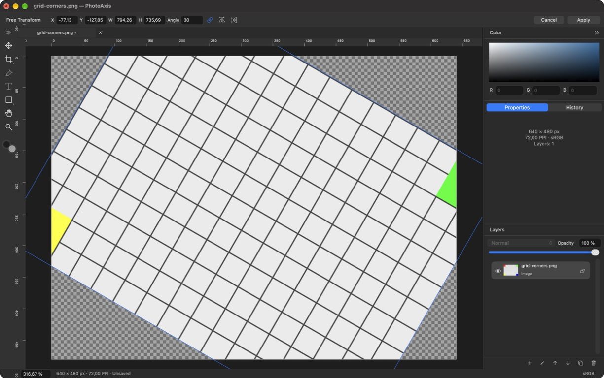

# P03 — Layers, Undo/History và Move/Transform

**Trạng thái: DONE — 24/09/2026, trong phạm vi layer ảnh P03.** PhotoAxis **1.0.0 (1)**, đặc tả **1.0-draft.3**. Tiếp nối P02 tại `8354543ad86c758af549b70d2a4a4470d7319fa4`, nhánh main. Không có remote, không push/public.

## Thay đổi thực tế — F05, F06, F12 và phần F03/F15

- Layers có thumbnail, loại/tên, chọn một lớp bằng UUID, đổi tên Unicode, ẩn/hiện, khóa, opacity, nhân bản/xóa và kéo đổi thứ tự; thêm nút lên/xuống truy cập native. Khóa chặn sửa nội dung/ma trận/opacity/order/delete/rename, cho chọn/ẩn-hiện/mở khóa; duplicate giữ khóa của bản gốc. Duplicate dùng chung nguồn immutable, tham số riêng. Giới hạn 50 lớp vẫn được kiểm tra trong model.
- Renderer Normal trong linear sRGB; opacity/alpha theo thứ tự layer. Auto-Select tìm từ trên xuống qua inverse matrix và alpha pixel, bỏ hidden/locked/opacity=0. Nguồn ảnh không bị ghi lại; frame/thumbnail/hit-test chạy ngoài MainActor.
- Core history giữ snapshot metadata và semantic command ID; UndoManager có nhóm tường minh, localized command names. Tối đa 100 bước/128 MiB, gồm encoded nguồn có thể chỉ còn được lịch sử giữ ở cả nhánh Undo và Redo; không sao chép toàn ảnh mỗi command. Prune mục cũ nhất, thu hồi nguồn không còn live/history reference. Budget history không phải tổng RSS.
- UUID state làm saved marker; Undo về đúng state trở lại clean, nhánh mới cắt Redo, prune không dời marker sang nội dung khác. API markSaved đã kiểm chứng; Save thật thuộc P09. Open/New vẫn báo Chưa lưu đúng tình trạng.
- Move, Arrow 1 px/Shift+Arrow 10 px, căn giữa canvas. Free Transform Cmd+T có X/Y/W/H/góc, liên kết tỷ lệ mặc định, flip ngang/dọc; tám tay nắm resize và một tay nắm rotate. Shift đảo liên kết khi kéo, quay bắt góc tuyệt đối 15°. X/Y/W/H là bounding box trong canvas; phép mới nhân lên projective matrix cũ, không reset phối cảnh.
- Session original/preview riêng theo tab; Apply/Return tạo một command, Cancel/Escape bỏ preview. Đổi tab giữ phiên; đổi tool/chọn lớp/chỉnh khác/đóng hỏi Apply/Discard/Cancel. Keyboard repeat Move một bước, mất focus hoặc keyUp kết thúc. Pan trong phiên không vào Undo; thả mouse khi Space đang giữ chốt Move ở preview cuối. Gesture quay về trạng thái gốc không thêm entry/cắt Redo.
- Ô số theo vùng macOS, độc lập vi/en; field editor ưu tiên Undo/text/phím tắt. **199 khóa vi/en, 193 tham chiếu**. Công cụ các chặng sau/Save/Export vẫn disabled. Transform giữ vùng Apply/Cancel, Options dài có popover overflow.

Kiến trúc và giới hạn geometry ở [KIEN_TRUC](../KIEN_TRUC.md); quyết định ADR-012/013 ở [QUYET_DINH_KY_THUAT](../QUYET_DINH_KY_THUAT.md). Geometry chặn pole trong miền ảnh, góc vượt ±1,000,000 px và bbox nhỏ hơn 0.01 px trước renderer; scale handle không đi qua anchor, dùng Flip để lật. Chưa triển khai solver crop hoặc renderer clip/text/ellipse/line trong P03.

## Kiểm tra và bằng chứng

Máy MacBookPro18,3, M1 Pro/32 GiB, Retina 2×, macOS 27.0 (26A428), Xcode 27.0 (27A266a), SDK 27, Swift 6.4/language 6. Target arm64/macOS 14.0; macOS 14 thực chưa kiểm chứng. Build ngoài Documents, ký ad-hoc local, chưa Developer ID/notarization.

| Kiểm tra | Kết quả | Phạm vi |
| --- | --- | --- |
| Debug/test | PASS | 38 test = 15 Core + 23 AppKit; 0 fail/skip/runtime warning. [Summary](bang-chung/P03/test-summary.json), [log](bang-chung/P03/debug-test.log) |
| Release | PASS | [Build log](bang-chung/P03/release-build.log), [binary/signature](bang-chung/P03/binary-verification.log) |
| Project/localization | PASS | [Project inventory](bang-chung/P03/project-check.log), [199 khóa/193 tham chiếu](bang-chung/P03/localization-check.log) |
| Model/layers/geometry | PASS | Lock/visibility, shared source/quota/GC, projective composition, flip hai lần, pole/nonfinite/out-of-range atomic rejection |
| History/Undo | PASS | Nhiều command qua UndoManager, redo/branch, saved state, prune 100/budget, source trong redo, Cancel không dirty; session giữa tab độc lập |
| Render/alpha | PASS | Pixel oracle Normal 50% đỏ trên trắng: G/B sRGB ≈0.735357, alpha-aware hit, order/visibility. [Opacity](bang-chung/P03/normal-opacity-50.png), [transform](bang-chung/P03/transform-preview.png) |
| Native component input | PASS | Hosted AppKit window: handles trên Retina, scale/Shift, rotate+Shift, arrow repeat, Escape rollback, Space-pan/release, overlay khớp matrix/frame; opacity action và fields/đổi tab |
| Native Release | PASS phạm vi P03 | Layers/rename/opacity/lock/order/delete/History branch, Transform/Apply/Undo/Redo, resolve dialog và pointer Move; [nhật ký](bang-chung/P03/native-qa.txt). Chỉ fixture tự tạo |
| Layout P01 hồi quy | PASS phần shell | 7 test P01 và 6 layout vi/en qua; [đo point](bang-chung/P03/layout-measurements.json). Workspace rỗng không thay nghiệm thu mọi phiên Transform |
| Drag/pinch/non-Retina/đổi màn hình/macOS 14/IME/CI | CHƯA KIỂM CHỨNG đầy đủ | Không suy ra thao tác chuột vật lý từ hosted responder; CI chưa có remote. Telex/VNI Type thuộc P06/P11 |
| Save/Export/recovery/benchmark | CHƯA TRIỂN KHAI hoặc CHƯA KIỂM CHỨNG | P09–P12; saved marker hiện được thử bằng API, không tuyên bố file đã lưu |

Lệnh đã chạy: `python3 scripts/generate-project.py`, `python3 scripts/generate-project.py --check`, `python3 scripts/check-localization.py`, `./scripts/check.sh`, `./scripts/build.sh Release`. Các kiểm tra hậu kỳ dùng xcresulttool summary, codesign verify deep/strict, file/vtool/dwarfdump. Log chuẩn hóa đường dẫn và bỏ thông tin định danh thiết bị; không giữ ảnh/file cá nhân.

[Manifest](bang-chung/P03/build-manifest.json) ghi source fingerprint, SHA-256 binary/bằng chứng, toolchain và xcresult. App Release tại `/Users/admin/Library/Developer/PhotoAxisBuilds/83990cd22abb/DerivedData/Build/Products/Release/PhotoAxis.app`. Các fixture vẫn ở [Fixtures/P02](../../Fixtures/P02), chỉ nhúng vào test bundle; P03 không cần bộ ảnh bên ngoài.

## Sửa lỗi khi kiểm tra

- Opacity action từng bị refresh UI trong lúc bắt đầu session trả giá trị slider về cũ: đọc giá trị trước, chỉ commit session do slider sở hữu; test 37% → Undo 100%.
- Các trường Transform dùng chung field editor làm bỏ refresh mọi trường khi sửa một ô: kiểm tra currentEditor của từng field. W liên kết cập nhật H ngay; test 320→240.
- Move options không cập nhật khi hai tab cùng tool: refresh trạng thái checkbox theo document mỗi lần.
- Thả chuột khi Space-pan từng có thể để session Move dở: kết thúc ở preview cuối, không lấy pan delta làm transform; responder regression.
- Session về đúng dữ liệu ban đầu khác revision render từng tạo history rỗng: so nội dung, không dùng revision để xác định thay đổi.
- History chọn trạng thái trước khi Apply có thể bị lệch index sau prune: giữ state UUID và tìm lại sau giải quyết session. Cancel chọn lớp/history khôi phục highlight theo state thật.
- Text focus không có UndoManager không được fallback sang Undo của tài liệu. Pending Auto-Select bị hủy khi viewport đổi.

Warning build của AppIntents không có dependency, log PNG fixture cố ý hỏng và dịch vụ macOS được giữ như P02; không tắt kiểm tra để làm log xanh.

## Bàn giao

A10–A11 trong phạm vi ảnh và A26 có model/render/hosted evidence; native QA bổ sung đã hoàn tất, giới hạn nghiệm thu rộng hơn ghi riêng. Các ca toàn V1.0 không được tick thay cho phần text/shape, Save hoặc nghiệm thu thiết bị còn thiếu. Checklist và tiến độ phải khớp trạng thái cuối chặng. P04 tiếp theo là Crop thường/kích thước canvas; không triển khai trong P03.

## Hoàn tất native QA

Máy đã mở lại; [nhật ký](bang-chung/P03/native-qa.txt) phân biệt lượt Việt trước sửa overlay với lượt English trên binary cuối. Phát hiện đường điều khiển vẽ tràn thanh Options khi layer vượt viewport; đã bật masksToBounds cho overlay. Chạy lại **38/38 PASS**, Release PASS và chữ ký/UUID khớp bản QA. Pointer Move qua CUA đã thực hiện được, số X/Y đổi tương ứng; không suy ra pinch/đổi màn hình hoặc kéo reorder đã nghiệm thu từ đó.

Chuỗi: [trước, Việt](bang-chung/P03/native-before-vi.png) → [preview, Việt](bang-chung/P03/native-transform-preview-vi.png) → [Undo bản cuối](bang-chung/P03/final-undo-en.png) → [Redo bản cuối](bang-chung/P03/final-redo-en.png). [AX History/lock](bang-chung/P03/native-history-lock-vi.ax.txt), [AX Transform](bang-chung/P03/final-transform-en.ax.txt), [AX Move](bang-chung/P03/final-move-en.ax.txt). Preview Việt giữ bằng chứng lỗi overlay trước sửa; ảnh English chứng minh đã sửa. Hai capture bị trắng một phần đã loại khỏi hồ sơ.

Fingerprint cuối `14a91dcc779840000af3354b76ae3a5e79bd226ce3b686ff2c0e72764a9a10d2`; result `PhotoAxis-20260924-131559-36499.xcresult`. Commit local hoàn tất P03 chứa sửa overlay và bằng chứng; tra `git log -1 --format='%H %s' -- docs/bao-cao/P03.md`. **Tiếp theo P04**, theo yêu cầu người dùng hoàn tất và chuyển bước tiếp theo. Save thật, text/shape, IME, macOS 14/non-Retina và nghiệm thu tích hợp toàn bộ tiếp tục theo chặng đã duyệt.
