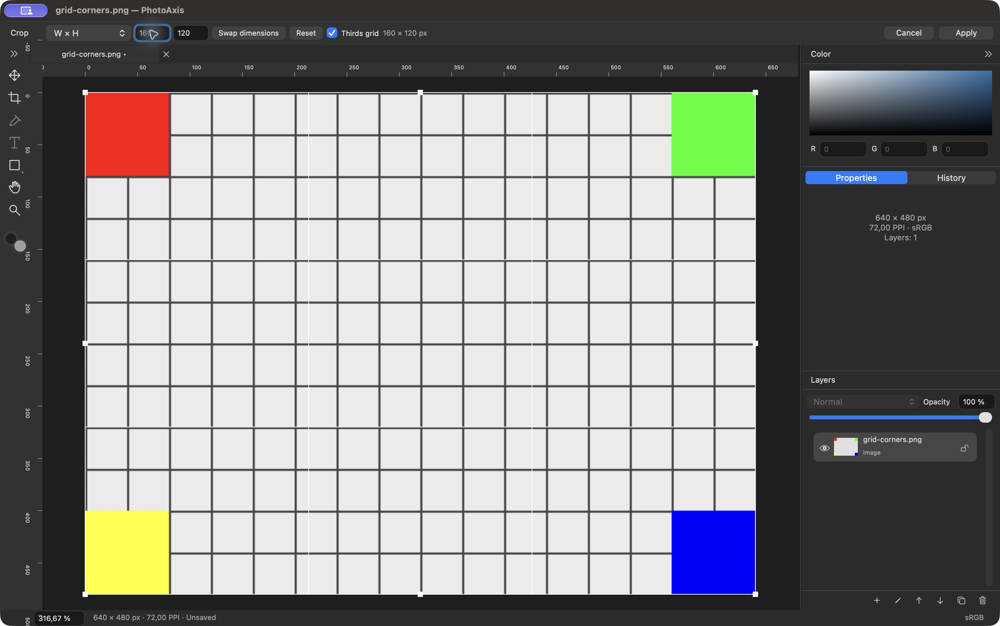

# P04 — Crop thường, Image Size và Canvas Size

**Trạng thái: DONE — 26/09/2026, trong phạm vi image/nền rectangle của P04.** PhotoAxis **1.0.0 (1)**, đặc tả **1.0-draft.3**. Tiếp nối P03 đã hoàn tất tại `a72ce89`, nhánh `main`. Không có remote, không push/public. Native QA, mã nguồn, kiểm thử và bằng chứng đã được thực hiện; P05 chưa triển khai trong chặng này.

## Thay đổi — F07 và phần F03/F12/F15

- Crop chữ nhật native (C hoặc nhóm Crop): tám tay nắm góc/cạnh, kéo vùng giữa, rule of thirds, vùng tối ngoài khung. Khung giới hạn trong canvas; pan/zoom không sửa model. Free, Original, 1:1, 4:3, 3:2, 16:9, A4, Custom; Swap, Reset, Apply/Return và Cancel/Escape.
- Ratio lấy pixel từ vùng cắt, làm tròn kích thước nguyên; W×H nhận số nguyên và resample sau crop. Nhãn cho biết số pixel đầu ra. Từ chối giá trị không hợp lệ, tỷ lệ không hữu hạn, cạnh quá 8000 hoặc canvas quá 40 MP trước cấp phát ảnh. Số tỷ lệ/PPI theo vùng macOS, không phụ thuộc ngôn ngữ UI.
- Crop đổi canvas và mọi layer, gồm hidden/locked, bằng phép ghép ma trận và giao clip trong layer local. Layer ngoài khung vẫn tồn tại với clip rỗng có nghĩa “không hiển thị”; giữ source bytes, UUID và payload. Không có tùy chọn xóa nguồn; crop lần hai giao clip cũ. Canvas Size/Move/rotate về sau không tự lộ vùng đã cắt.
- Renderer rasterize clip trước transform; viewport và `renderDocument` dùng chung composite. Đường image-only giữ alpha, không checkerboard/lưới/handles. Đây là nền cho export P10, chưa có UI Export.
- Image Size scale canvas và toàn layer; liên kết tỷ lệ bật mặc định. Chỉ đổi PPI thì giữ nguyên pixel dimensions và ma trận layer. Canvas Size có anchor 3×3, không scale nội dung. Rotate 90°/180°/270° và Flip ngang/dọc là lệnh toàn tài liệu.
- Mỗi Apply là một command; phiên Crop riêng từng tab và không tự commit khi đổi tab. Crop/Transform dùng chung Apply/Discard/Cancel tại đổi tool, thao tác chỉnh khác và đóng/quit. Apply thất bại giữ phiên. Sau Apply/Cancel trở lại tool trước Crop. Save/Export vẫn disabled, sẽ nối vào cùng cơ chế ở P09/P10.
- Giao diện và lỗi có **221 khóa vi/en, 213 tham chiếu đã giải quyết**. Options quá dài có popover; Apply/Cancel giữ chỗ riêng. Nguồn, kích thước và nội dung không thay khi đổi ngôn ngữ.

Quyết định clip và basis nhập số: ADR-014/015 ở [QUYET_DINH_KY_THUAT](../QUYET_DINH_KY_THUAT.md); hợp đồng chi tiết ở [KIEN_TRUC](../KIEN_TRUC.md).

## Kiểm tra và bằng chứng

MacBookPro18,3, Apple M1 Pro/32 GiB, Retina 2×; macOS 27.0 (26A428), Xcode 27.0 (27A266a), SDK 27, Swift 6.4/language 6. Target arm64/macOS 14.0. Build ngoài Documents, ký ad-hoc local, chưa Developer ID/notarization. Fixture tự tạo [grid-corners.png](../../Fixtures/P02/grid-corners.png); SHA-256 nguồn đã đối chiếu manifest P02.

| Kiểm tra | Kết quả | Bằng chứng/phạm vi |
| --- | --- | --- |
| Debug/test | PASS | **47 test = 20 Core + 27 AppKit**, 0 fail/skip/runtimeWarnings. [Summary](bang-chung/P04/test-summary.json), [log](bang-chung/P04/debug-test.log) |
| Release và binary | PASS | [Build log](bang-chung/P04/release-build.log), [chữ ký, arm64/minOS/UUID](bang-chung/P04/binary-verification.log); executable QA cùng UUID với Release |
| Project/localization | PASS | [Inventory](bang-chung/P04/project-check.log), [221 khóa/213 tham chiếu](bang-chung/P04/localization-check.log) |
| Geometry/model | PASS | Crop nhiều layer hidden/locked; source/UUID giữ nguyên; clip lặp/fully outside; projective composition; atomic rejection; chín anchor; PPI-only; rotate/flip |
| Pixel/render | PASS | 320×240 góc đỏ, 160×120 bốn góc đúng hướng; alpha=0 ngoài clip sau expand + Move + rotate; byte nguồn giữ nguyên; image-only không overlay |
| History/session | PASS | Một Apply một entry; Undo/Redo khôi phục model/kích thước và clean marker; Cancel không thêm entry; phiên theo tab độc lập; nhập số tuần tự, invalid → valid, ratio overflow |
| Hosted native input | PASS | Kéo góc Crop ở 100%/Retina, tám handles, pan cập nhật overlay không đổi region; Cancel/Apply; Image Size fields/link và quota |
| Native Release Việt/Anh | PASS phạm vi P04 | Free drag → Apply/Undo/Redo; Canvas Size → clip vẫn kín; rotate; Ratio/Swap/Reset/grid/Cancel; W×H invalid/valid; Image Size/PPI; Flip; resolve Cancel. [Nhật ký và provenance](bang-chung/P04/native-qa.txt) |
| Hồi quy workspace | PASS | Các test P01–P03 vẫn qua; [layout](bang-chung/P04/layout-measurements.json) là workspace rỗng, không thay nghiệm thu mọi trạng thái Crop |
| Tích hợp toàn V1.0, thiết bị và hiệu năng | CHƯA KIỂM CHỨNG | Text/shape editable, Save/Open/Export, macOS 14 thực, non-Retina/đổi màn hình/pinch/IME, benchmark và stress P12 |

Lệnh: `python3 scripts/generate-project.py`, `python3 scripts/generate-project.py --check`, `python3 scripts/check-localization.py`, `./scripts/check.sh`, `./scripts/build.sh Release`; hậu kiểm bằng xcresulttool, codesign verify deep/strict, file/vtool/dwarfdump và SHA-256. Result cuối: `PhotoAxis-20260926-143753-44514.xcresult`. Log chuẩn hóa đường dẫn và bỏ ID thiết bị; cảnh báo AppIntents không có dependency, lỗi fixture hỏng chủ ý hoặc log dịch vụ macOS không bị che để giả kết quả xanh.

[Manifest](bang-chung/P04/build-manifest.json) chứa danh sách source, fingerprint, SHA-256 executable/bằng chứng và cấu hình. App mở được tại `/Users/admin/Library/Developer/PhotoAxisBuilds/83990cd22abb/DerivedData/Build/Products/Release/PhotoAxis.app`. Bản QA cô lập ở `QA/P04-final/PhotoAxis Crop Final.app` dưới cùng build root. Không đưa app bundle/DerivedData vào Git.

## Sửa lỗi qua kiểm tra thực tế

1. Nhãn Options còn “Bàn tay” khi Crop bắt đầu trước callback activeTool: lấy nhãn từ loại session; thêm assertion trên cửa sổ hosted và xác nhận native Việt/Anh.
2. Nhập W×H từng chữ số fit nối tiếp làm khung co dần; có thể vẫn invalid dù sửa 8001 về 160. CropState giữ basis từ lần kéo/Reset, fit từng thay đổi số từ basis đó và chỉ thay region khi candidate hợp lệ. Regression “1 → 16 → 160 → 8001 → 160” và native 8001×120 → 160×120 đều qua.
3. Custom Ratio có hai toán hạng hữu hạn vẫn có thể overflow khi chia: thêm guard tỷ lệ hữu hạn/dương, thử với 308 chữ số và mẫu số rất nhỏ. Lượt này chỉ đổi validation, không đổi layout/render; chạy lại toàn 47 test/Release và mở lại executable cuối. Không tuyên bố đã lặp lại toàn chuỗi UI sau guard này.

Ảnh Việt là lượt sau sửa nhãn, trước sửa nhập số. Các ảnh `*-final-en` của Crop/Image Size/Flip là lượt sau sửa nhập số, trước guard overflow cuối; [final-launch](bang-chung/P04/final-launch-en.ax.txt) ghi lần mở bản guard cuối. Các PNG image-only được sinh lại bởi test cuối. Nhật ký phân biệt các mốc này để không gắn nhầm bằng chứng với source.

Bằng chứng thêm: [Crop 320×240 tiếng Việt](bang-chung/P04/crop-preview-vi.png), [Canvas Size](bang-chung/P04/canvas-size-vi.png), [clip sau mở rộng](bang-chung/P04/clip-after-expand-vi.png), [xoay 90°](bang-chung/P04/rotate-vi.png), [Image Size](bang-chung/P04/image-size-final-en.png), [Flip](bang-chung/P04/flip-final-en.png). Output pixel: [crop góc trái](bang-chung/P04/crop-top-left.png), [160×120](bang-chung/P04/crop-resampled-160x120.png), [expand/move/rotate giữ alpha](bang-chung/P04/crop-expand-move-rotate.png).

## Bàn giao

A12/A13 có model, pixel và native evidence trong phạm vi P04; các checkbox toàn V1.0 vẫn để mở theo phần tích hợp/thiết bị còn thiếu trong [checklist](../CHECKLIST_NGHIEM_THU_V1.0.md). Không có lỗi đã biết chặn chặng tiếp theo. Mask grayscale tối đa 40 MB mỗi source theo quota không phải giới hạn tổng RAM; P12 cần đo thực tế. Chưa hỗ trợ Type/ellipse/line renderer ở P04; bounds và payload mới tiếp tục ở P06/P07.

Commit local chứa báo cáo, mã và bằng chứng; tra `git log -1 --format='%H %s' -- docs/bao-cao/P04.md`. **Chặng tiếp theo: P05 — Perspective Crop trên ảnh đơn**, đã đủ phụ thuộc P00–P04; thực hiện solver/tứ giác/preview theo prompt và đặc tả, không hỏi lại phạm vi đã duyệt. Save `.paxis` P09, Export P10, recovery P11 và public P13–P15 vẫn theo lộ trình.
