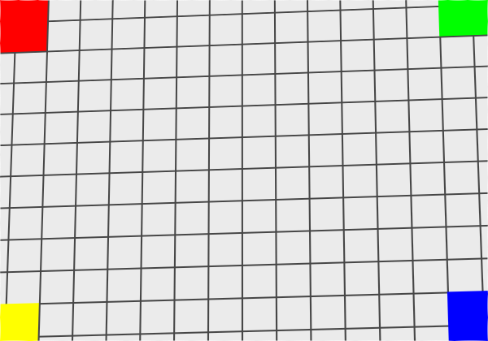
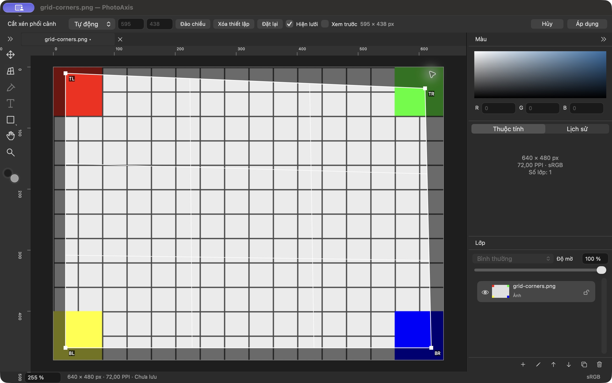

# P05 — Perspective Crop trên một ảnh

**Trạng thái: DONE — 27/09/2026, trong phạm vi ảnh đơn của P05.** PhotoAxis **1.0.0 (1)**, đặc tả **1.0-draft.3**, tiếp nối P04 `cf84825` trên `main`. Có mã chạy native, kiểm thử số học/pixel và thao tác giao diện Việt/Anh. **F08 chưa hoàn tất toàn V1.0:** nhiều layer editable P07, Save/Open P09 và Export P10 vẫn là các chặng riêng. Không có remote, không push/public.

## Thay đổi — F08 và phần F03/F12/F15

- Perspective Crop có trong nhóm Crop và phím **Shift+C**. Kéo tạo hình chữ nhật ban đầu, chỉnh riêng bốn góc TL/TR/BR/BL hoặc kéo giữa để dịch cả tứ giác; giới hạn trong canvas. Grid được chiếu ngược từ đầu ra; vùng ngoài khung được làm tối. Tay nắm 8 point và hit radius 8 point không phụ thuộc mức zoom. Space-pan/zoom dùng viewport hiện có, overlay đồng bộ với frame đã trình bày.
- Solver Double chuẩn hóa theo canvas, giữ thứ tự góc cố định, tính homography document → output và kiểm lại inverse/corners. Từ chối góc trùng, tứ giác lõm/tự cắt, cạnh dưới 1 px, diện tích dưới 4 px², sin góc dưới 1e-4, tọa độ không hữu hạn/ngoài canvas và miền mẫu số qua 0. Khung lỗi đỏ, có giải thích và Apply bị tắt.
- **Auto** lấy trung bình các cặp cạnh đối diện; **Ratio** giữ gần diện tích Auto rồi ép tỷ lệ, làm tròn pixel cuối; **W×H** dùng hai số nguyên. Preflight cạnh ≤8000 px và diện tích ≤40 MP trước cấp phát ảnh. Swap chỉ đảo đầu ra; Clear về Auto giữ quad; Reset về canvas giữ mode. Có Original, 1:1, 4:3, 3:2, 16:9, A4 và tỷ lệ tùy chỉnh.
- Preview dùng candidate tạm, có thể bật/tắt và trở lại chỉnh góc; không thêm History. Apply tạo một command và thay canvas; Cancel giữ model/canvas trước phiên. Phiên thuộc từng tab. Byte nguồn, ID và payload layer được giữ; mọi layer kể cả hidden/locked nhận phép ghép ma trận và clip local. Không thay nguồn bằng bitmap đã flatten.
- Renderer dùng chung geometry/composite cho viewport và `renderDocument` image-only. Khi phép chiếu của toàn nguồn đi qua điểm suy biến nhưng vùng giữ lại vẫn hợp lệ, kernel Metal lấy mẫu ngược với extent bằng canvas hữu hạn. Sau mở rộng canvas, Move/rotate hoặc crop tiếp, vùng đã loại không xuất hiện lại. Hit-test bỏ điểm inverse không xác định ở ngoài support.
- Chuỗi mới được dịch ngay: **231 khóa vi/en, 223 tham chiếu**. Options hỗ trợ overflow, Apply/Cancel giữ vùng riêng. Lỗi dài có ellipsis, tooltip/AX giữ đầy đủ lý do. Native vẫn là AppKit/MetalKit/Core Image; không thêm dependency bên thứ ba.

Hợp đồng và ngưỡng số học ghi ở **ADR-016/017** trong [quyết định kỹ thuật](../QUYET_DINH_KY_THUAT.md), cùng [kiến trúc](../KIEN_TRUC.md). Kernel biên dịch offline vào `Perspective.metallib`, giữ sandbox build script; máy build cần Metal Toolchain chính thức như [hướng dẫn build](../HUONG_DAN_BUILD.md).

## Kết quả kiểm tra

MacBookPro18,3, Apple M1 Pro/32 GiB, Retina 2×; macOS 27.0 (26A428), Xcode 27.0 (27A266a), SDK 27, Swift 6.4/language 6. Target arm64/macOS 14.0. Build ngoài Documents; ký ad-hoc local, chưa Developer ID/notarization.

| Kiểm tra | Kết quả | Bằng chứng/phạm vi |
| --- | --- | --- |
| Debug/test cuối | **PASS: 60/60** | 26 Core + 34 AppKit; 0 fail/skip/runtimeWarnings. [Summary](bang-chung/P05/test-summary.json), [log](bang-chung/P05/debug-test.log) |
| Release/binary | **PASS** | [Build log](bang-chung/P05/release-build.log), [codesign deep/strict, arm64/minOS và UUID](bang-chung/P05/binary-verification.log). Release và app QA cùng UUID, cùng Core framework/Metal kernel |
| Project/localization | **PASS** | [Inventory](bang-chung/P05/project-check.log), [vi/en](bang-chung/P05/localization-check.log) |
| Homography/domain | **PASS** | Bốn góc, inverse, grid phi tuyến, 121 điểm từ ma trận tham chiếu độc lập, trường hợp không hợp lệ, Auto/Ratio/quota và cập nhật model nguyên tử |
| Pixel/nguồn | **PASS** | Bốn màu góc đúng thứ tự; EXIF 6; gradient sRGB và viền alpha theo inverse độc lập; Preview/Apply có RGBA bytes bằng nhau; byte nguồn không đổi |
| Clip/pole | **PASS** | Pole ngoài vùng giữ được render đúng; mở rộng canvas vẫn transparent ngoài clip; hit-test tại pole trả nil; Move/rotate/crop lần hai và Undo giữ nguồn/model |
| Session/history | **PASS** | Một Apply một entry, Preview/grid không entry; Undo/Redo/Cancel và đổi tab; mode invalid→valid, Swap/Clear/Reset |
| Hosted AppKit | **PASS** | Mouse/key responder thực trong NSWindow, bốn góc ở zoom 50/100/200%, kéo giữa và Space-pan; controls vi/en; [layout 1440/1100 pt và overflow component 900 pt](bang-chung/P05/perspective-layout.json) |
| Native Release Việt/Anh | **PASS phạm vi P05** | Quad/TR/Preview/Apply/Undo/Redo; W×H invalid/valid, A4/Swap/Reset/Clear/grid/Cancel; [nhật ký](bang-chung/P05/native-qa.txt) |
| Thiết bị/hiệu năng/tích hợp toàn V1.0 | **CHƯA KIỂM CHỨNG** | Non-Retina/đổi màn hình, pinch vật lý, macOS 14 thực, IME, benchmark/stress; text/shape/multilayer editable, Save/Open/Export |

Lệnh đã chạy: `python3 scripts/generate-project.py`, `python3 scripts/generate-project.py --check`, `python3 scripts/check-localization.py`, `./scripts/check.sh`, `./scripts/build.sh Release`; hậu kiểm bằng `xcresulttool`, `codesign`, `file`, `vtool`, `dwarfdump` và SHA-256. Result cuối được lưu bền vững là **`PhotoAxis-20260927-231307-27046.xcresult`**. Lượt 17:13 cũng đạt 60 test; lượt cuối lặp lại để lưu log sau khi log `/tmp` không còn. Không có thay đổi source giữa native QA cuối và lượt kiểm tra này.

Log đã chuẩn hóa đường dẫn/ID thiết bị. Cảnh báo dịch vụ macOS, DVT launch diagnostics và dữ liệu fixture hỏng chủ ý được giữ trong log; `runtimeWarnings` của test summary là rỗng, không được hiểu là mọi dòng log hệ thống đều im lặng.

[Build manifest](bang-chung/P05/build-manifest.json) chứa fingerprint danh sách source gồm `.metal`, SHA-256 binary/kernel/ảnh/log và cấu hình máy. SHA-256 fixture P02 đã được đối chiếu manifest gốc. App có thể mở tại `/Users/admin/Library/Developer/PhotoAxisBuilds/83990cd22abb/DerivedData/Build/Products/Release/PhotoAxis.app`; bản QA cô lập là `QA/P05-final/PhotoAxis Perspective Final.app` dưới cùng build root. Các app bundle và DerivedData không vào Git.

## Thông số và ảnh tham chiếu

Fixture đều tự tạo ở [Fixtures/P02](../../Fixtures/P02). Ảnh dưới đây là output của renderer image-only từ test, chưa phải bằng chứng có UI Export.

| Bộ thử | Góc nguồn TL → TR → BR → BL | Đầu ra/oracle |
| --- | --- | --- |
| Grid bốn màu | (20,10), (620,35), (605,460), (35,445) | 600×420, tolerance RGB 0.025; Auto cùng quad = 585×430 |
| EXIF orientation 6 | (12,15), (460,25), (450,620), (20,610), trên nguồn chuẩn hóa 480×640 | 450×600, góc vàng/đỏ/xanh lá/xanh dương, tolerance RGB 0.04 |
| Gradient/alpha | Quad sinh từ inverse đã biết `[1.2,0.08,25; 0.04,1.1,30; 0.0003,0.0002,1]` tại bốn góc đầu ra | 400×300; RGB ≤0.012, blue ≤0.006, alpha ≤0.025; sai số premultiplied red ≤2/255, green ≤1/255 |
| Pole ngoài clip | (250,150), (390,150), (600,450), (40,450) | 400×300; inverse độc lập `[0.35,-0.8,250; 0,-0.125,150; 0,-0.0025,1]`; pole nguồn y=50 nằm ngoài vùng giữ y=150…450 |

[Thông số grid JSON](bang-chung/P05/parameters.json) ghi thứ tự góc/kích thước. Test gradient dùng tâm pixel `(x+0.5,y+0.5)`, gắn profile thực của bitmap trước đối chiếu sRGB và xét premultiplied alpha để không khuếch đại lượng tử hóa RGBA8 tại alpha thấp.

Ảnh liên quan: [grid trước](bang-chung/P05/grid-before.png), [crop lặp](bang-chung/P05/grid-repeat-crop.png), [gradient](bang-chung/P05/reference-colors-srgb.png), [alpha](bang-chung/P05/reference-alpha-edges.png), [EXIF trước](bang-chung/P05/exif-before.png), [EXIF sau](bang-chung/P05/exif-after.png), [pole ngoài clip](bang-chung/P05/pole-outside-clip.png), [expand/move/rotate](bang-chung/P05/pole-expand-move-rotate.png).

Native tiếng Việt kéo tạo Auto 600×450 rồi chỉnh TR thành **595×438**, Preview/Apply giữ đúng bốn màu. Undo về 640×480; Redo về 595×438. Native English chặn 8001, sửa **320×240** rồi Preview/Apply/Undo; A4 cho 466×659, Swap thành 659×466, Reset giữ Ratio, Clear về Auto và Cancel không đổi model.

[Preview vi](bang-chung/P05/perspective-preview-vi.png), [Apply vi](bang-chung/P05/perspective-applied-vi.png), [Undo vi](bang-chung/P05/perspective-undo-vi.png), [lỗi kích thước en](bang-chung/P05/perspective-invalid-output-en.png), [Preview en](bang-chung/P05/perspective-preview-en.png), [Apply en](bang-chung/P05/perspective-applied-en.png). Nhật ký tách rõ native CUA, hosted responder và backing scale mô phỏng; không suy ra pinch/thiết bị thật từ test số học.

## Vấn đề đã xử lý và bàn giao

1. Guard toàn bitmap ban đầu từ chối cả quad hợp lệ có pole ở phần đã cắt. Sửa domain theo retained support và dùng inverse kernel với output extent hữu hạn. Thêm regression gradient/clip/hit-test/expand/move/rotate/crop tiếp; không nới kiểm tra pole trên vùng giữ.
2. Oracle màu ban đầu dùng NSCalibratedRGB như sRGB, cộng sai số unpremultiply tại alpha thấp. Gắn profile của bitmap và kiểm tra premultiplied components; không nới dung sai tùy ý để bỏ lỗi hình học.
3. Build sandbox không cho intermediate shader ở DERIVED_FILE_DIR. Chuyển vào TEMP_DIR có quyền, khai báo input/output; giữ sandbox bật. Kernel offline từ Metal Toolchain chính thức đã được nhúng và kiểm tra hash.

Không có lỗi đã biết chặn **P06 — Type, Shape, Color**. P06 dùng lại typed payload, source registry, geometry/clip và History; P07 phải kiểm chứng text/shape còn editable sau Perspective và layer mới nằm trong canvas mới. Kernel fallback hiện có ROI toàn source theo quota; P12 cần đo thời gian/RSS và cân nhắc tối ưu ROI. Các ca A14–A17/A21 có bằng chứng ảnh đơn; phần thiết bị và tích hợp còn lại ghi trong [checklist](../CHECKLIST_NGHIEM_THU_V1.0.md), không tuyên bố toàn A01–A43/R01–R12 đạt.

Commit local chứa source, tests, báo cáo và bằng chứng; tra `git log -1 --format='%H %s' -- docs/bao-cao/P05.md`. P06 đã đủ phụ thuộc P00–P05 và là chặng chưa hoàn thành đầu tiên.
