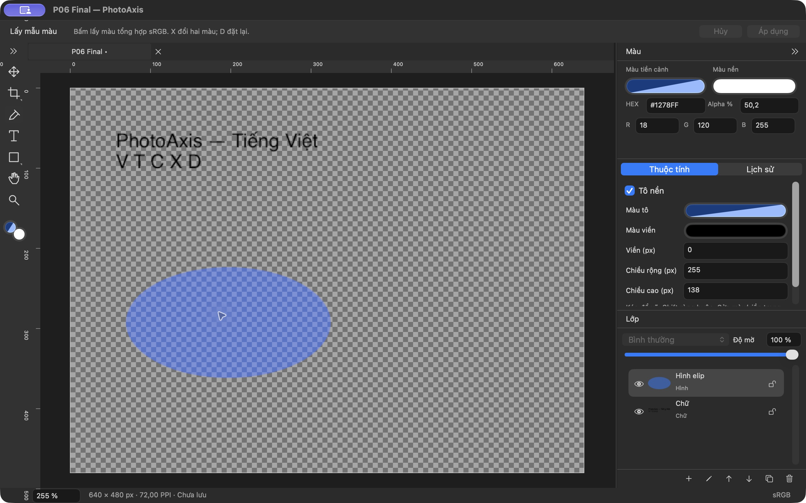
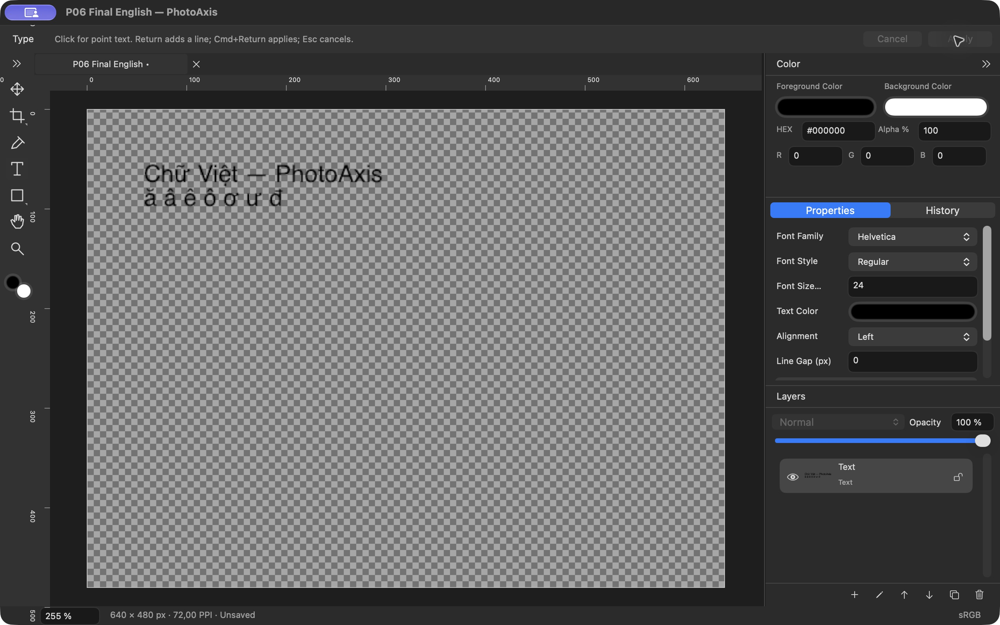

# P06 — Type, Shape, Color

**Cập nhật 03/10/2026:** [P12-native2](P12-native2.md) có A04/A07/A26 PASS nativeVI/EN build3, tổng19/43PASS; benchmark build3 mới3PASS. Phím Telex VI/đa dòng/Save/Escape có bằng chứng thực; nguồn nhậpEN/VNI/composition đầy đủ còn thiếu nên P06/A22/P12/R02 vẫn chưa chốt. Nội dung/binary/số đo bên dưới giữ phạm vi lịch sử đã ghi.

**Trạng thái: BLOCKED_EXTERNAL — 29/09/2026, còn nghiệm thu Telex/VNI thực tế (A22).** Mã nguồn, bản Release, kiểm thử model/render/AppKit và QA native Việt/Anh đã thực hiện. Không đánh dấu DONE khi ca bộ gõ thực chưa có bằng chứng. Tiếp nối P05 `ac9fef7` trên `main`; PhotoAxis **1.0.0 (1)** theo đặc tả **1.0-draft.3**. Không push/public.

## Đầu ra đã triển khai

- **F09 — Type:** point text Unicode nhiều dòng, font cài trên máy với family/style, cỡ 1–1000 px, màu sRGB/alpha, trái/giữa/phải và line spacing. Model giữ payload chữ; bitmap Core Text chỉ là kết quả render tạm. Bounds chữ tham gia matrix/clip/Move/Transform/History hiện có.
- Trình nhập `NSTextView` native trên canvas giữ marked text, input context và typing undo riêng. Return xuống dòng, Cmd+Return chốt, Escape hủy; V/T/C/X/D/Space ở vùng nhập không chuyển công cụ. Một phiên Apply tạo một command; Cancel hoặc chữ trắng rỗng không để lại layer rác.
- Text có hệ số phối cảnh chỉnh trong Properties, giữ matrix/clip. Nhấn đúp thumbnail layer mở đúng trình nhập; nhấn đúp tên vẫn đổi tên theo mục 7. Tích hợp đầy đủ với Perspective Crop nhiều layer còn ở P07.
- Font thiếu giữ nguyên tên gốc và thông báo, fallback chỉ để xem; thay font có Undo. Không tuyên bố hình fallback giống font gốc. Không nhúng file font.
- **F10 — Shape/Color:** Rectangle/Ellipse/Line kéo tạo, Shift ràng buộc vuông/tròn/góc 45°; Fill/None, màu và độ dày Stroke, kích thước chỉnh lại được. Dữ liệu vẫn là shape. HEX/RGB/alpha và FG/BG đồng bộ; X đổi chỗ, D đặt lại ở canvas.
- Eyedropper lấy document pixel của composite sRGB, giữ alpha; bỏ checkerboard/overlay/handles. Alpha-aware hit-test áp dụng cho text/shape. Quota, lock, opacity, selection và history dùng chung với layer ảnh.
- **258 khóa vi/en, 250 tham chiếu**. Bảng thuộc tính cuộn và co giãn ở panel hẹp. ADR-018 trong [quyết định kỹ thuật](../QUYET_DINH_KY_THUAT.md) mô tả cấu trúc, guard và renderer; [kiến trúc](../KIEN_TRUC.md) đã cập nhật.

App mở được tại `/Users/admin/Library/Developer/PhotoAxisBuilds/83990cd22abb/DerivedData/Build/Products/Release/PhotoAxis.app`. Hai bản QA cuối cô lập ở `QA/P06-verified/PhotoAxis P06 vi.app` và `PhotoAxis P06 en.app` dưới cùng build root. Chúng cùng executable UUID/Core framework/Metal kernel với Release, chỉ đổi bundle ID và ký lại ad-hoc. App/build artifacts nằm ngoài Git.

## Kiểm tra và bằng chứng

Máy Apple M1 Pro/32 GiB, MacBookPro18,3, Retina 2×; macOS 27.0 (26A428), Xcode 27.0 (27A266a), SDK 27, Swift 6.4/language 6. Target arm64/minOS 14.0; ký local ad-hoc, chưa Developer ID/notarization. Không suy ra macOS 14 thực từ deployment target.

| Hạng mục | Kết quả | Phạm vi |
| --- | --- | --- |
| Debug/test | **69 PASS, 0 FAIL, 1 SKIP** | 29 Core PASS + 40 AppKit PASS; một test Telex thiếu nguồn nhập trong context. `runtimeWarnings=[]`. [Summary](bang-chung/P06/test-summary.json), [log](bang-chung/P06/debug-test.log) |
| Release/chữ ký | **PASS** | [Build](bang-chung/P06/release-build.log), [codesign deep/strict, arm64/minOS/UUID](bang-chung/P06/binary-verification.log) |
| Project/vi-en | **PASS** | [Inventory](bang-chung/P06/project-check.log), [localization](bang-chung/P06/localization-check.log) |
| Text/model/history | **PASS** | Unicode/multiline; tạo/sửa/Cancel/Undo/Redo; saved marker; lock/quota; typed duplicate; giữ clip/matrix; thiếu font và thay font có Undo |
| Pixel/alpha | **PASS** | Căn lề, biên glyph dấu Việt, alpha 0.75; ellipse fill .5/outline/opacity, góc trong suốt không hit; sample không có overlay |
| Hosted native editor | **PASS** | Marked text chặn Apply, commit Unicode, Return/Cmd+Return/Escape; routing Properties cho projective; numeric Apply/Cancel không mở lại phiên |
| Native Release VI/EN | **PASS cho các thao tác đã ghi** | Unicode, nhiều dòng, font style/size/alignment/spacing, Apply/Undo/Redo/Cancel; shape, HEX/RGB/X/D, sample alpha; nhấn đúp thumbnail. [Nhật ký](bang-chung/P06/native-qa.txt) |
| Telex/VNI thực tế | **CHƯA KIỂM CHỨNG — chặn DONE P06** | Context của test chỉ có ABC, ca IME bị skip. [Nguồn nhập thực sự thấy](bang-chung/P06/native-ime.txt). Chưa nhận kết quả kiểm tra tay |
| Thiết bị/hiệu năng/tích hợp | **CHƯA KIỂM CHỨNG** | macOS 14/non-Retina, stress/benchmark P12; mixed-layer crop P07; Save/Open P09; Export P10 |

Lệnh đã chạy: `python3 scripts/generate-project.py`, `python3 scripts/generate-project.py --check`, `python3 scripts/check-localization.py`, `./scripts/check.sh`, `./scripts/build.sh Release`, `xcresulttool`, `codesign`, `file`, `vtool`, `dwarfdump` và kiểm tra SHA-256. Result cuối: **`PhotoAxis-20260928-194219-51733.xcresult`**; hậu kiểm native bản cuối ngày 29/09. Không sửa source sau lượt test/build cuối. Lượt 69/69 trước khi thêm ca IME không được dùng để che ca SKIP của bộ cuối.

Log chuẩn hóa đường dẫn và ID máy; warning dịch vụ Apple/fixture ảnh hỏng chủ ý có thể xuất hiện, khác với runtimeWarnings của test summary. [Manifest](bang-chung/P06/build-manifest.json) chứa fingerprint source, binary/QA UUID, hash evidence và phân biệt bản QA thăm dò với bản cuối. Những ảnh không có tiền tố `final-` chụp trước ba sửa cuối về focus Apply/Cancel, font invalid và nhãn alpha; nhật ký nêu rõ nguồn từng ảnh.

## Hình ảnh đã đối chiếu

Bản cuối Việt: chữ hai dòng, ellipse alpha 50%; Eyedropper trả HEX `#1278FF`, RGB `18/120/255`, alpha `50,2%` do lượng tử hóa 128/255, không lấy màu checkerboard.

Bản cuối English giữ nguyên chữ tiếng Việt, dấu đặc trưng và font size 24 sau Apply từ ô số. Nhấn đúp thumbnail sửa nội dung rồi Escape giữ chữ cũ.

[Validation cỡ 1001](bang-chung/P06/final-invalid-vi.png), [Cancel English](bang-chung/P06/final-cancel-en.png), [định dạng chữ VI](bang-chung/P06/text-edit-vi.png), [rectangle/ellipse/line](bang-chung/P06/shapes-sample-vi.png). Ảnh image-only từ renderer test: [chữ Việt](bang-chung/P06/vietnamese-text.png), [căn lề/alpha](bang-chung/P06/text-alignment-alpha.png), [ellipse alpha](bang-chung/P06/ellipse-alpha.png), [ellipse outline/opacity](bang-chung/P06/ellipse-outline-opacity.png). PNG có alpha; nền đen của trình xem có thể làm chữ đen không rõ. Đây là output kiểm thử renderer, chưa phải UI Export.

## Lỗi đã sửa và phần bàn giao

1. Layout inspector NSStackView khởi tạo ở zero bounds gây hàng nghìn constraint warnings. Chuyển sang các row thủ công co giãn; test vi/en ở panel hẹp và lượt cuối không còn runtimeWarnings.
2. Căn giữa/phải trong editor không được dùng text container rộng vô hạn. Giới hạn theo local text layout, giữ nhiều dòng do Return và không tự wrap.
3. Apply/Cancel từ numeric field có thể nhận action kết thúc nhập sau transaction và mở lại phiên. Đưa focus về canvas trước transaction; regression kiểm tra session/history/giá trị và native hậu kiểm cả hai ngôn ngữ đã qua.
4. Draft font size lỗi có thể truyền giá trị quá lớn vào AppKit. Editor dùng style/extent hợp lệ gần nhất trong khi field vẫn báo lỗi và Apply disabled. Regression `1e100`; native 1001 → Cancel về 24.

**Điều kiện còn thiếu để chốt P06:** trên app native, chọn Telex/VNI đang dùng, gõ chữ Việt có dấu, Return xuống dòng, V/T/C/Space trong composition, Cmd+Return/Apply và Escape; ghi bộ gõ/macOS/kết quả. Không dùng Unicode paste hoặc `setMarkedText` để tuyên bố đã kiểm chứng Telex/VNI. Câu hỏi xác nhận đã gửi, chưa có kết quả khi chốt báo cáo. Không yêu cầu lại phê duyệt phạm vi; đây là bằng chứng nghiệm thu A22 từ prompt P06 còn thiếu.

Source/tests/báo cáo P06 đã commit local tại `494b24e`. Save/Export chưa có; xem [checklist](../CHECKLIST_NGHIEM_THU_V1.0.md) để phân biệt bằng chứng từng phần với nghiệm thu toàn V1.0.

## Bổ sung ngày 01/10/2026

Theo yêu cầu tiếp tục triển khai, phần Perspective nhiều layer độc lập đã hoàn tất ở [P07](P07.md); P06 vẫn **BLOCKED_EXTERNAL A22**, không đổi thành DONE. Dedicated IME recheck sau `NSApp.activate`/`NSTextInputContext.activate` yêu cầu Simple Telex nhưng selected source vẫn ABC, available sources chỉ ABC; [giá trị thực](bang-chung/P07/native-ime-recheck.txt), [log](bang-chung/P07/native-ime-recheck.log). Chưa có kết quả kiểm tra tay Telex/VNI.

Bộ hồi quy hiện tại 77 PASS/0 FAIL/1 IME SKIP, thêm một cảnh báo QoS tại shape Cancel/focus của test P07; [summary mới](bang-chung/P07/test-summary.json). Bằng chứng P06 gốc 69 PASS/1 SKIP/0 runtimeWarnings ở trên thuộc binary/commit P06 và vẫn giữ nguyên. P07 sửa routing projective theo tỷ lệ matrix, focus/scroll Properties và canvas full-clip; báo cáo P07 nêu phạm vi native VI/EN và phần chưa kiểm chứng. Chặng chức năng tiếp theo P08; A22 cần được bổ sung trước nghiệm thu chung.
