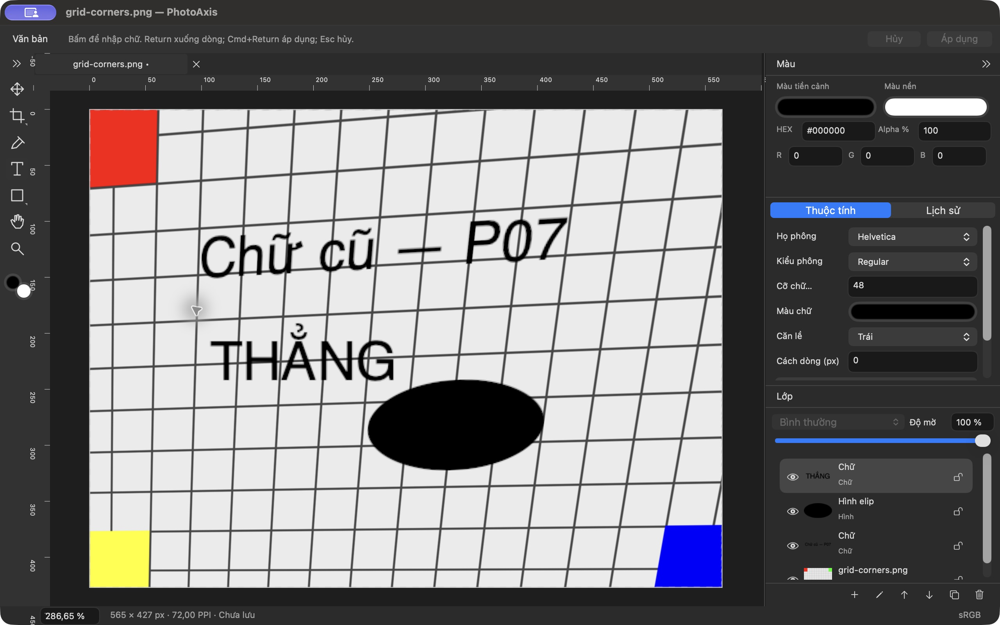
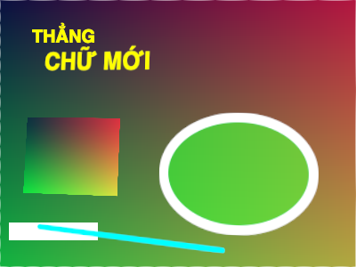

# P07 — Perspective Crop nhiều layer và chỉnh tiếp

**Cập nhật native sau báo cáo này:** xem [P15-native](P15-native.md). Bản sửa tiến độ 787e3d1 có 113 PASS/0 FAIL/4 SKIP; bằng chứng D54 và 667 được tách rõ, không dùng mô tả chờ desktop ở mốc cũ làm trạng thái hiện hành.

**Trạng thái: DONE — 01/10/2026, trong phạm vi P07.** A18, A19 và A21 đạt trên fixture ảnh/chữ/hình, gồm layer ẩn/khóa, với kiểm tra model, pixel và thao tác native. P06 vẫn **BLOCKED_EXTERNAL ở A22** vì chưa có kết quả gõ Telex/VNI thực tế; P07 triển khai phần độc lập theo yêu cầu tiếp tục của người dùng, không đổi trạng thái P06 thành DONE. Tiếp nối commit `494b24e` trên `main`, PhotoAxis **1.0.0 (1)** theo **1.0-draft.3**. Chỉ commit local, không push/public.

## Đầu ra và lỗi đã sửa

- **F08/F05:** toàn bộ layer cũ dùng cùng H, ghép `M_new = H × M_old`, gồm hidden/locked. Canvas, matrix và local clip đổi nguyên tử. Giữ UUID/order/type/payload/opacity/flags/source; không có đường flatten. Một Apply tạo một history entry; lỗi ở layer cuối không làm thay đổi các layer đã tính trước đó.
- **F08/F09:** sửa chữ cũ qua Properties giữ phép chiếu và clip; chữ mới sau crop nằm thẳng trong canvas mới. Shape giữ Fill/Stroke; hit-test/Move/Transform dùng mapping projective. Image mới Place cũng không nhận H cũ.
- **F08/F12:** Undo/Redo và crop lần hai khôi phục đúng model, canvas, source, saved marker; mở canvas lớn hơn, Move, sửa kích thước shape hoặc bật layer cũ không làm hiện lại vùng đã crop. `[]` và `[[]]` có nghĩa khác nhau, được ghi rõ trong contract P09.
- Sửa nhận biết affine/projective: ngưỡng tuyệt đối của hệ số ma trận làm hai ma trận tương đương chọn khác editor. `isAffine` dùng tỷ lệ của hàng mẫu số, kiểm tra hệ số đồng nhất từ `1e-100` tới `1e100` và số âm.
- Sửa Properties: text editor tự cuộn vào vùng nhìn thấy trước focus ở cửa sổ thấp; double-click shape chọn Properties và focus ô kích thước, không focus `NSTextView` đang ẩn.
- Sửa renderer khi toàn bộ nội dung bị crop hết: `CIImage.empty()` không tạo được CGImage đầu ra. Composite nay bắt đầu bằng canvas trong suốt hữu hạn; bỏ qua full-clip/opacity 0 trước cấp phát bitmap chữ/hình. Payload vẫn còn để Undo và layer mới vẫn vẽ được.

[Kiến trúc](../KIEN_TRUC.md), [ADR-019](../QUYET_DINH_KY_THUAT.md) và [hợp đồng dữ liệu `.paxis`](../HOP_DONG_DU_LIEU_PAXIS.md) ghi thứ tự ma trận, nguồn dùng chung, clip, font thiếu, typed payload và các kiểm tra round-trip cần ở P09. Chưa có serializer, Save/Open hoặc Export UI.

## Kiểm tra và bằng chứng

Máy M1 Pro/32 GiB, MacBookPro18,3, Retina 2×; macOS 27.0 (26A428), Xcode 27.0 (27A266a), SDK 27, Swift 6.4/language 6, arm64/minOS 14.0. Ký ad-hoc local, chưa Developer ID/notarization. Deployment target không thay kiểm tra trên macOS 14 thật.

| Hạng mục | Kết quả | Bằng chứng và giới hạn |
| --- | --- | --- |
| Debug/test toàn bộ | **77 PASS, 0 FAIL, 1 SKIP** | 31 Core + 46 AppKit PASS; 1 IME SKIP. Có **1 runtime warning QoS**, không ghi thành 0. [Summary](bang-chung/P07/test-summary.json), [log](bang-chung/P07/debug-test.log) |
| Project, plist, dịch vi/en | **PASS** | [Inventory](bang-chung/P07/project-check.log), [258 khóa/250 tham chiếu](bang-chung/P07/localization-check.log); không thêm chuỗi mới P07 |
| Release/chữ ký/fixture | **PASS** | [Build](bang-chung/P07/release-build.log), [codesign deep/strict + arm64/minOS/UUID](bang-chung/P07/binary-verification.log), SHA-256 fixture/nguồn/bằng chứng trong [manifest](bang-chung/P07/build-manifest.json) |
| A18 — cùng H, giữ editable | **PASS** | 6 layer: hai ảnh chung một source, chữ Việt, ellipse, rectangle ẩn, line khóa. Kiểm tra mapping độc lập, payload/flags/source, rollback nguyên tử và pixel composite |
| A19 — sửa cũ/thêm mới/chỉnh tiếp | **PASS** | Properties giữ matrix/clip khi đổi chữ; shape sửa Fill/Stroke; hit alpha, Move +12/+8, resize width ×1.2; text/shape/image mới affine và clip `[]` |
| A21 — Undo/Redo/clip | **PASS** | Preview = Apply theo byte RGBA, một command; hai crop Undo/Redo; hidden/unlock; clip không hồi sinh sau canvas expand/Move/đổi payload. Tất cả layer full-clip vẫn tạo canvas trong suốt |
| Lặp và tài nguyên | **PASS phạm vi fixture nhỏ** | 24 vòng crop/Undo/Redo/Move/render; 6 layer, 1 nguồn 6.986 byte không đổi; History 49 bước/471.875 byte; decoded cache 1.228.800 byte → 0 sau release. [Số đo](bang-chung/P07/repeat-resources.json); chưa phải benchmark P12 |
| Hosted native VI/EN | **PASS chức năng** | NSWindow 1100×700 pt: text Properties thấy ít nhất 100 pt chiều cao, nhận focus; Apply/Cancel đúng history; từ History mở shape chuyển về Properties và focus ô số. Ca này có cảnh báo QoS khi Cancel |
| Release native VI | **PASS thao tác đã ghi** | Quad/Preview/Apply/Undo/Redo, hidden/locked, sửa chữ Properties, thêm chữ thẳng và sửa outline ellipse. [Nhật ký và ảnh](bang-chung/P07/native-qa.txt) |
| Release native EN | **CHƯA KIỂM CHỨNG đủ chuỗi pointer P07** | Đổi ngôn ngữ/khởi động lại đã xác nhận English. CUA gặp lỗi pipe/clipboard trong sheet Go To Folder của macOS; chưa hoàn tất chuỗi mixed-layer qua pointer EN. Hosted VI/EN đã PASS; bổ sung pointer EN ở P12 |
| P06 A22 — Telex/VNI | **CHƯA KIỂM CHỨNG** | Yêu cầu Simple Telex nhưng input context vẫn chọn ABC. [Giá trị thực](bang-chung/P07/native-ime-recheck.txt), [log chạy riêng](bang-chung/P07/native-ime-recheck.log); chưa có kết quả kiểm tra tay |

Oracle pixel chiếu ngược composite trước crop bằng ma trận output→input biết trước, độc lập với solver. 2.111 mẫu vùng trơn, gồm 213 mẫu foreground, sai số kênh lớn nhất `0.007843` (2/255), ngưỡng `0.018`. Loại các biên tương phản khỏi phép so sánh này để không lẫn hình học với kernel nội suy; alpha/clip có assertion riêng. [Thông số và kết quả](bang-chung/P07/pixel-oracle.json).

Lệnh đã chạy: `./scripts/check.sh`, `./scripts/build.sh Release`, `python3 scripts/generate-project.py --check`, `python3 scripts/check-localization.py`, `xcresulttool`, `codesign`, `file`, `vtool`, `dwarfdump` và SHA-256. Result cuối **`PhotoAxis-20261001-110624-80299.xcresult`**; chạy lại IME riêng **`P06-IME-20261001-110223.xcresult`**. Source sản phẩm không đổi sau Release ngày 01/10; thay đổi sau Release chỉ ở test cách gửi action Apply/Cancel, đã chạy lại cả suite. Không tắt checker để làm sạch summary.

## Đối chiếu hình ảnh

Native Release: chữ cũ và ellipse chịu phối cảnh cùng ảnh; chữ **THẲNG** thêm sau crop vẫn nằm ngang. Đây là app thật, không phải mockup.

[Sửa Fill/Stroke ellipse sau crop](bang-chung/P07/native-shape-edit-vi.png), [Properties sửa chữ cũ](bang-chung/P07/native-properties-vi.png), [Preview](bang-chung/P07/native-preview-vi.png), [Undo](bang-chung/P07/native-undo-vi.png).

Output renderer test giữ typed model sau khi đổi chữ, sửa ellipse và thêm layer mới:

[Trước crop](bang-chung/P07/mixed-before.png), [sau crop](bang-chung/P07/mixed-after.png), [crop lần hai](bang-chung/P07/mixed-second-crop.png), [bật ẩn/mở khóa](bang-chung/P07/unhidden-unlocked.png), [clip sau resize/Move/sửa](bang-chung/P07/clip-after-resize-move-edit.png), [full-clip và chữ mới](bang-chung/P07/fully-clipped-plus-new-text.png). PNG từ test chưa phải luồng Export UI.

## Tồn đọng và bàn giao

1. **Chặn chốt P06:** người dùng hoặc một phiên kiểm thử có bộ gõ thực cần xác nhận A22: bộ gõ/macOS, tiếng Việt có dấu, Return, V/T/C/Space trong composition, Cmd+Return/Apply và Escape. Context test hiện chỉ thấy ABC; Unicode paste/marked-text không thay thế nghiệm thu này. Không chặn phần chức năng độc lập đã kiểm chứng của P07.
2. **Theo dõi P12, mức ảnh hưởng hiện quan sát thấp:** một cảnh báo thread QoS tại `MultiLayerPerspectiveTests.swift:226`, khi action Cancel đưa focus từ ô số shape về canvas. Test hoàn tất PASS; log/diagnostics chưa xác định nguyên nhân gốc hoặc chứng minh cảnh báo chỉ do AppKit. Chưa đo độ trễ UI trong tình huống này. Giữ warning trong bằng chứng và kiểm tra tiếp bằng Instruments/stack ở P12; không suy ra đã hết vấn đề hiệu năng.
3. **Nghiệm thu bổ sung P12:** chuỗi pointer English chưa hoàn tất vì CUA lỗi sheet hệ thống; macOS 14/non-Retina, stress 40 MP/50 layer/120 MP và RSS/GPU chưa kiểm chứng. Các assertion VI/EN không thay nghiệm thu toàn A40/A42.
4. **A20 vẫn chưa tick:** Save/Open P09, Export P10, recovery P11 và ký/phát hành P13–P15 chưa triển khai. F08 toàn V1.0 còn phụ thuộc persistence/export; P07 DONE chỉ theo điều kiện của prompt 07.

App mở được ở `$BUILD_ROOT/DerivedData/Build/Products/Release/PhotoAxis.app`, với `$BUILD_ROOT = ~/Library/Developer/PhotoAxisBuilds/83990cd22abb`. Bản QA cô lập ở `QA/P07/PhotoAxis P07 vi.app` và `PhotoAxis P07 en.app`, cùng executable UUID **3CCB3F2D-EF3B-358A-86DB-BCFC694AD77D** với Release; khác bundle ID/chữ ký như manifest. Không dùng hai bản QA đang chứa tài liệu thử chưa lưu để lưu công việc thật.

Commit chứa source/tests/báo cáo được tra bằng `git log -1 --format='%H %s' -- docs/bao-cao/P07.md`. Chặng triển khai tiếp là **P08 — Điều chỉnh ảnh**; vẫn phải bổ sung A22 trước khi chốt P06 và trước nghiệm thu chung V1.0. Xem [tiến độ](../TIEN_DO_TRIEN_KHAI.md) và [checklist](../CHECKLIST_NGHIEM_THU_V1.0.md).
