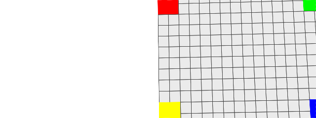
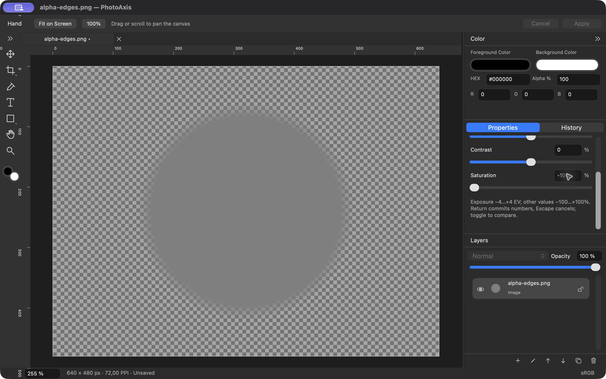

# P08 — Điều chỉnh ảnh theo layer

**Trạng thái: DONE — 01/10/2026, theo phạm vi prompt 08.** Phần điều chỉnh/Enable/Reset/Undo của A25 đạt; phần Save/reopen chuyển P09 nên **A25 toàn ca vẫn chưa tick**. P06 vẫn **BLOCKED_EXTERNAL A22 Telex/VNI**, không suy ra đã đạt từ lời nhắn “tiếp tục”. Tiếp nối commit `0eeba37` trên `main`, PhotoAxis **1.0.0 (1)** theo **1.0-draft.3**. Chỉ commit local, không remote/push/public.

## Đầu ra

`ImageAdjustments` là metadata riêng trên layer ảnh: enabled và bốn số Double theo đơn vị UI. Setter kiểm finite/range/loại layer/lock nguyên tử; giá trị sai không sửa model. Exposure −4…+4 EV, Brightness/Contrast/Saturation −100…+100%; bốn giá trị trung tính 0. Enabled=false chỉ bypass, giữ số; Reset đặt 0 và enabled=true. Duplicate sao chép tham số, tiếp tục dùng cùng source; Geometry/Crop/Move/Transform giữ tham số, không flatten hoặc sửa ảnh gốc.

Properties AppKit có bốn NSSlider, ô số và EV/%, checkbox Enable, Reset và vùng cuộn. Nhóm hiện với layer image; khóa layer hoặc đang sửa nội dung khác chặn controls có lý do vi/en. Numeric dùng locale macOS, preview riêng; Return hoặc Apply chốt một command, Cancel/Escape phục hồi snapshot. Một lần kéo nhiều tick chỉ có một history entry khi nhả chuột. Enable/Reset có Undo riêng và restored saved marker/nhánh lịch sử như các command khác.

Renderer áp filter trong working space linear-sRGB hiện có theo thứ tự cố định trước local clip → transform → opacity → composite:

| Bước | Giá trị UI | Mapping PhotoAxis 1.0 |
| --- | --- | --- |
| Exposure | −4…+4 EV | CIExposureAdjust inputEV = EV |
| Brightness/Contrast | −100…+100% | CIColorControls brightness=b/100, contrast=1+c/100, saturation=1 |
| Saturation | −100…+100% | CIColorControls saturation=1+s/100, brightness=0, contrast=1 |
| Neutral hoặc disabled | bốn số 0 hoặc enabled=false | Bypass toàn nhóm, không thêm filter |

Mapping được ghi trong [ADR-020](../QUYET_DINH_KY_THUAT.md), với [Core Image Filter Reference của Apple](https://developer.apple.com/library/archive/documentation/GraphicsImaging/Reference/CoreImageFilterReference/index.html). Không cam kết cùng con số cho kết quả giống Photoshop. Alpha không bị sửa; Saturation −100 cho xám. Thumbnail dùng cùng filter. Source bytes/ID không đổi; model đủ dữ liệu cho serializer P09 theo [hợp đồng `.paxis`](../HOP_DONG_DU_LIEU_PAXIS.md).

Nguồn đã chuẩn hóa ở decoded cache theo source ID. Không decode từng tick hoặc lưu raster điều chỉnh trong model. Canvas dùng cancellation/generation theo snapshot để bỏ kết quả cũ khi preview nhanh hoặc đổi tab. Thumbnail key gồm content và adjustments; generation đổi ngay cả khi Undo trở về key đã cache để completion cũ không ghi đè.

## Lỗi phát hiện và sửa

- Native QA ban đầu: slider nhấp được nhưng kéo chỉ nhận điểm bắt đầu với tracking loop cũ. TransactionSlider vẫn dùng NSSlider/cell native, xử lý down/drag/up, giữ offset khi nắm knob và clamp bar/min/max. Refresh không ghi đè cell đang tracking, nhả chuột chốt session một lần. Hosted responder test có 12 tick/one Undo và hồi quy opacity, sau đó kiểm lại bằng CUA trên Release.
- Begin session gọi refresh đồng bộ, ghi đè giá trị vừa nhập/action slider bằng model cũ. Chụp numeric input hoặc slider value trước callback. Lượt cuối kiểm AX setValue=2 tạo đúng Exposure=2 và một history entry.
- Numeric action tự gửi khi kết thúc focus khiến click Cancel có thể commit trước khi hủy. Tắt sendsActionOnEndEditing, Return/Apply chốt tường minh; click Cancel và Escape đã kiểm. Canvas arrow không ghép Move vào phiên adjustments.
- Duplicate trước đây chỉ sao chép content/geometry/flags. Bổ sung adjustments, có Core test giữ source chung và params; lock/nonimage/invalid vẫn chặn mutation.

## Kiểm tra và bằng chứng

M1 Pro/32 GiB, macOS 27.0 (26A428), Xcode 27.0 (27A266a), SDK 27, Swift 6.4/language 6, arm64/minOS 14.0, Retina 2×. Deployment target không thay nghiệm thu macOS 14 thật. Ký ad-hoc local, chưa Developer ID/notarization.

| Hạng mục | Kết quả | Bằng chứng/giới hạn |
| --- | --- | --- |
| Debug/test toàn suite | **84 PASS, 0 FAIL, 1 SKIP** | 33 Core + 51 AppKit PASS; 1 IME SKIP, **1 runtime warning QoS cũ P07**. [Summary](bang-chung/P08/test-summary.json), [log](bang-chung/P08/debug-test.log) |
| Project/plist/localization | **PASS** | [Project](bang-chung/P08/project-check.log), [268 khóa/255 tham chiếu vi/en](bang-chung/P08/localization-check.log) |
| Release/chữ ký/fixture | **PASS** | [Build](bang-chung/P08/release-build.log), [codesign deep/strict + UUID/arm64/minOS](bang-chung/P08/binary-verification.log), source/fixture/evidence SHA-256 trong [manifest](bang-chung/P08/build-manifest.json) |
| Bounds/guards/history | **PASS** | NaN/infinity/out-of-range/locked/nonimage, invalid Apply bị chặn; preview/Cancel/Undo/Redo/branch/saved marker, Enable/Reset và duplicate giữ nguồn |
| Neutral/extrema/mapping | **PASS** | Neutral và disabled byte RGBA bằng gốc; sat−100 kênh bằng nhau; brightness ±100 đen/trắng; contrast−100 về 0.5 linear→~0.735 sRGB; EV±4, contrast/sat+100; oracle EV0.5/contrast−25/brightness3 độc lập, dung sai 0.008 |
| Alpha/layer khác/Perspective | **PASS** | 1.102 mẫu alpha, 87 mẫu một phần, dung sai 1/255; nguồn/matrix/clip không đổi; layer grid bên phải không đổi khi chỉnh layer alpha bên trái sau crop 1280×480→640×240. [Pixel checks](bang-chung/P08/pixel-checks.json) |
| Hosted native VI/EN | **PASS** | NSWindow 1100×700 pt; scroll/labels/field width, 12 tick/1 Undo, numeric/validation/Cancel/lock, nontracking action giữ 2 EV; opacity preview/1 Undo/Undo hồi quy |
| Release native | **PASS trong phạm vi nhật ký** | VI Exposure drag trên binary trước sửa action AX; EN final build AX/drag/numeric/validation/Cancel/Enable/Reset/Undo/Redo/gray/lock. [Nhật ký](bang-chung/P08/native-qa.txt) tách UUID từng lượt; chưa full pointer VI final hoặc chuột vật lý |
| Frame/cache/đo ngắn | **PASS fixture nhỏ** | 60 preview, đổi tab/latest frame; 20 warm render 640×480 không tăng decode. Cache 2.457.600 byte→0 khi release. [Số đo](bang-chung/P08/response-measurements.json); chưa benchmark P12 |

20 lượt render worker fixture nhỏ có trung vị **3,324 ms**, lớn nhất **4,747 ms**. normalizedDecodeCount=1 thuộc lần cache miss của asset khác; source đầu đã được prepare vào cache. Assertion so warm count trước–sau tick, không coi tổng count này là số lần giải mã mọi nguồn từ lúc khởi động. Không suy ra latency mouse-to-present hoặc đạt 40 MP/50 layer/120 MP/RSS/GPU.

Lệnh: `./scripts/check.sh`, `./scripts/build.sh Release`, inventory/localization/plutil, `xcresulttool`, `codesign`, `file`, `vtool`, `dwarfdump`, SHA-256 và CUA. Result cuối **PhotoAxis-20261001-232046-39226.xcresult**, Release build sau source cuối. App/kernel/framework final EN đồng nhất UUID/hash theo manifest; log chuẩn hóa đường dẫn/ID máy. Không tắt checker hoặc bỏ warning khỏi summary.

## Hình ảnh và provenance

Output renderer từ test, không phải tính năng Export UI: [neutral](bang-chung/P08/neutral.png), [EV−4](bang-chung/P08/exposure-minus4.png), [EV+4](bang-chung/P08/exposure-plus4.png), [combined order](bang-chung/P08/combined-order.png), [alpha edge](bang-chung/P08/alpha-adjusted.png).

Ảnh Release English cuối dùng alpha-edges.png, Saturation−100 còn alpha edge; thumbnail cũng xám:

Build cuối UUID **FF8AFACD-DEAE-3E9C-A849-DF55BFE9834C**: native-final-*; [AX action 2 EV](bang-chung/P08/native-final-accessibility-en.txt), [History một action](bang-chung/P08/native-final-history-en.txt), [validation](bang-chung/P08/native-final-invalid-en.txt), [bypass](bang-chung/P08/native-final-bypass-en.txt), [Undo Reset](bang-chung/P08/native-final-undo-reset-en.txt), [locked](bang-chung/P08/native-final-locked-en.txt).

Build pointer trước sửa nontracking value capture UUID **3496C2E0-C3A1-3E4E-ACA5-8D05049CAF49**: [VI exposure](bang-chung/P08/native-exposure-vi.png), [EN single-drag History](bang-chung/P08/native-single-drag-history-en.txt), [EN invalid](bang-chung/P08/native-invalid-en.png), [bypass](bang-chung/P08/native-bypass-en.png), [gray](bang-chung/P08/native-gray-en.png). Không gán ảnh này cho binary cuối. Nhóm vi completed là copy final ký/UUID đã kiểm, không có full pointer sequence; hosted VI/EN đã chạy source cuối.

## Bàn giao

1. **P09 tiếp theo:** serializer/reader ZIP `.paxis`, Save/Save As/Open an toàn. Round-trip source bytes/hash, typed content, params/fractions/enabled=false, matrix/clip/order/flags/PPI/shared assets, pixel render và saved marker; đóng/mở rồi sửa tiếp VI↔EN. A25 phần Save/reopen, A20 và A43 chưa tick.
2. **P06 A22 chưa đạt:** context test không có Telex/VNI thực; cần kết quả gõ tay hoặc phiên có bộ gõ thật với composition/Return/Cmd+Return/Escape/phím canvas. Không đổi P06 thành DONE.
3. **P12:** warning QoS tại shape Cancel/focus của P07 còn trong summary; chưa root cause/Instruments/UI latency. P07 full pointer English mixed-layer, full pointer VI build cuối, macOS 14/non-Retina/full quota/stress/accessibility/locale khác còn phải nghiệm thu. Lượt P08 English không thay P07 mixed-layer sequence.
4. **Chưa triển khai:** Save/Open P09, Export P10, Recovery P11, ký/phân phối P13–P15. Release hiện chỉ là bản phát triển local.

App: `$BUILD_ROOT/DerivedData/Build/Products/Release/PhotoAxis.app`, với `$BUILD_ROOT = ~/Library/Developer/PhotoAxisBuilds/83990cd22abb`; bản QA EN cuối `QA/P08/PhotoAxis P08 en verified.app`. Tra commit bằng `git log -1 --format='%H %s' -- docs/bao-cao/P08.md`. [Tiến độ](../TIEN_DO_TRIEN_KHAI.md), [checklist](../CHECKLIST_NGHIEM_THU_V1.0.md), [kiến trúc](../KIEN_TRUC.md).
