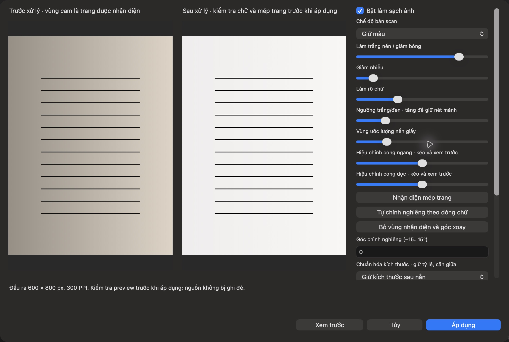
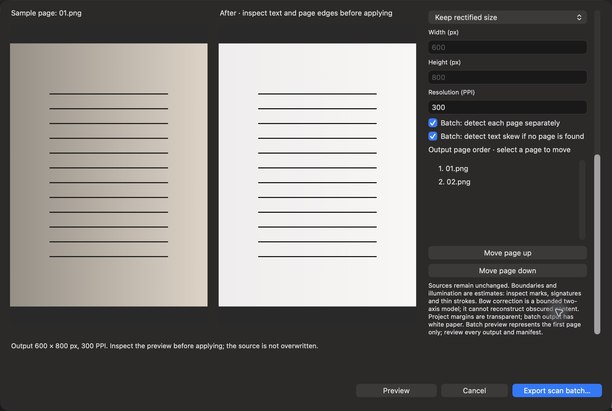

# Scan1 — kết quả triển khai, 03/10/2026

**Đã bổ sung chức năng xử lý bản scan vào PhotoAxis1.0.0(4), S01–S09 DONE local.** Source implementation `4947ff7f821929a4982085a5611442f3ccfe20e8`, native/offline, mở rộng theo yêu cầu người dùng; baseline1.0-draft.3 không đổi. [Đặc tả](../DAC_TA_SCAN.md), [hướng dẫn sử dụng](../HUONG_DAN_SCAN.md), [tiến độ toàn dự án](../TIEN_DO_TRIEN_KHAI.md).

## Nội dung hoàn thành

| Nhóm | Hành vi đã có | Kiểm chứng |
| --- | --- | --- |
| Nhận diện/căn trang | Vision tìm bốn góc giấy, outline/crop phối cảnh; tìm góc dòng chữ hoặc nhập±15° | Fixture trang biết vị trí, text4°, từ chối ảnh trắng, source/clip/hình học không mất |
| Làm sạch giấy | Color/Gray/BlackWhite, trắng nền/giảm bóng–ám màu, giảm nhiễu, làm rõ chữ, ngưỡng cục bộ | Nền gần trắng và trung tính, nét tối còn, alpha±1/255, disabled bypass chính xác |
| Nắn cong | Hai slider bow ngang/dọc, preview và biên giữ cố định | Đường cong độc lập biết trước có baseline spread60px→0px; crop/warp không hồi sinh nguồn đã loại |
| Chuẩn hóa/batch | Original/A4dọc-ngang/Letter/custom/PPI, fit giữ tỷ lệ/căn giữa;1–50ảnh, đổi thứ tự; PNG/project/PDF/manifest | Test kích thước/PPI/PDFmediaBox/pagecount/hashes/sourcebyte; nativeENbatch2trang đảo thứ tự và đối chiếu đầu ra độc lậpPASS; lỗi/Cancel không công bố lô dở |

Preview Apply/Cancel/generation guard; một Apply một commandUndo. Nguồn nguyên byte, Scan metadata được Save/Open/duplicate. Writer schema3 khi có Scan, otherwise1thường/2working; reader1/2/3, cấm downgrade chứa Scan. Tích hợp `.paxcase`: command/model/audit/Save/reopen/Undo/Redo, hash nguồn không đổi và review cũ stale. Batch độc lập không thay intake hoặc bản chia sẻ hồ sơ đã che.

## Kết quả kiểm tra cuối

- **Fullsuite159ca:155PASS /1FAIL /3SKIP** trên M1Pro32GB/macOS27.0.1/Xcode27. Các **11ca mới Scan** (2Core/8App/1audit) đềuPASS. Lượt full này chạy lại sau sửa duplicate metadata, localizationfields, folderpicker notification guard, batchcontrol lock và thêm test order/bounds.
- FAIL duy nhất `ContentEditingTests.testInstalledVietnameseInputContext`: sự kiện mô phỏng trả `tieengs vieetj ` thay `tiếng việt `. Đây là tồn đọng A22 đã biết, giữ nguyên test/lỗi. 3SKIP là benchmark opt-in, không coi performancePASS từ số test này.
- **Release build/ad-hoc codesignPASS**, arm64/minOS14, UUID **8A2E6A7C-4058-391B-A8F6-24F1BB32D380**; binarySHA `015a7ecc25f8e7d80f4c43cf45079a4eb440a1467eec6934c7e21db3c3734c1a`; CoreSHA `ea33582a060f7c8d37142df7c28a69aa76edf6963db1fc524d6ed8ab319e41e9`. Hai QA VI/EN UUID/Core khớp Release, BundleID/recovery riêng. Tests về order thêm sau Release không thay mã sản phẩm.
- **16policytestsPASS**, inventoryPASS, **452khóaVI/EN /381referencesPASS**, website12tranglinks/metadata/download-disabled/provenancePASS. Website cập nhật tính năng/hướng dẫn/release notes Scan VI/EN.
- NativeVI preview nguồn giấy ám màu→trắng, Apply300PPI→Undo72PPI→Redo300PPI; ENpreview/Cancel giữ72PPI. ENbatch OpenPanel2ảnh→đổi02/01→folderpicker→xuất hoàn tất; sourcebyte/hash/schema3/order/PNG/project/PDF hash khớp. Screenshot batch chụp trước đổi thứ tự, receipt ghi thứ tự cuối.
- Console vẫn có Metal `MDB_MAP_FULL`; xcresult ghi2QoS runtime warnings (một có source ExportTests). Không tắt checker/cache để làm sạch bằng chứng.

[Build/test manifest](bang-chung/SCAN-20261003/build-manifest.json), [test-summary](bang-chung/SCAN-20261003/test-summary.json), [native QA](bang-chung/SCAN-20261003/native-qa.md), [batch receipt độc lập](bang-chung/SCAN-20261003/native-batch-check.json), [tham số batch](bang-chung/SCAN-20261003/native-batch-manifest.json), [bow metrics](bang-chung/SCAN-20261003/bow-metrics.json).

## Nội dung chưa hoàn thiện và trạng thái public

Nắn cong là chỉnh bow hai trục **thủ công**; chưa tự dựng bề mặt3D mọi trang sách/nếp gấp, không phục hồi chữ khuất. Chưa nhập PDF/TIFF/batchOCR. Phát hiện trang/góc và bộ lọc cần người rà **từng trang**, nhất là chữ ký/mực nhạt/con dấu/nét mảnh. Dataset giấy/sách/camera thật, full50trang/quota/thời gian/memory, macOS14/non-Retina/M1-16GB chưa qualification. Crash/mất điện có thể để staging ẩn, Cancel chờ call framework đang chạy kết thúc.

Nguồn/GPS/pixelcrop còn nhúng trong `.paxis`; không chia sẻ project như bản đã che. Batch PNG/PDF chưa phải luồng bản chia sẻ hồ sơ đã rà soát. Hình học toàn tài liệu giữ text/shape editable; bow chỉ áp dụng image, chú thích khác cần kiểm vị trí. PPI không tạo thêm chi tiết. Reader cũ build3 từ chối Scan schema3.

Source/website tiếp tục publicGPLv3 theo đích đã duyệt; bộ cài build4 chỉ xuất **LOCAL-UNSIGNED** cùng receipt/hash ngoàiGit. Không phát hành stable/tag hoặc bật nút installer. `releaseReady=false`; còn gate IME/native tổng thể/thiết bị/hiệu năng/Metal-QoS/qualification điều tra và DeveloperID/notary/cài sạch. **19/43PASS** là nghiệm thu baselinebuild3 lịch sử, không tự nâng thành đủ nghiệm thu build4. [Readiness hiện tại](../READINESS_PUBLIC.json), [known issues](../KNOWN_ISSUES.md).
