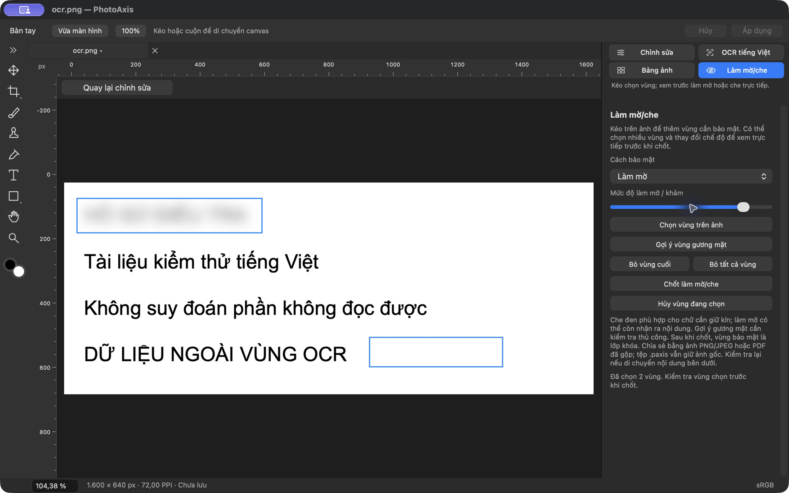
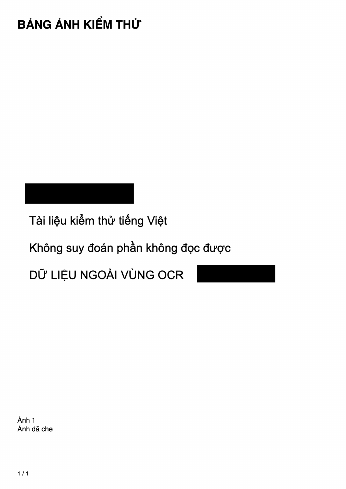

# OCR, bảng ảnh và bảo mật — build10, 04–05/10/2026

Đã triển khai yêu cầu mới: bỏ các chức năng điều tra khỏi giao diện sản phẩm, chỉ giữ OCR tiếng Việt và bảng ảnh; thêm làm mờ/che như chỉnh sửa ảnh thông thường. Hướng dẫn hiện hành: [OCR/Bảng ảnh/Bảo mật](../HUONG_DAN_OCR_BANG_ANH_BAO_MAT.md), phạm vi [Utilities1](../DAC_TA_TIEN_ICH_BAO_MAT.md).

## Kết quả triển khai

- **OCR:** current committed canvas hoặc ROI, native Vision accurate revision3 có `vi-*`; editable text/copy/TXT UTF-8, cancel và bỏ kết quả muộn khi context/tab thay đổi. Không tạo hồ sơ/hash/audit ở giao diện; không sửa model/nguồn/History. Engine không giả chữ hoặc fallback tiếng Anh.
- **Bảng ảnh:** addcurrent/multiplePNGJPEGHEICHEIF, danh sách riêng, reorder/remove/chú thích đúng từng ảnh, title/note,1/2/4/6photosperA4page,portrait/landscape,filenameoffdefault,pagechoice. Preview tự cập nhật; PDF tất cả trang hoặc PNG trang đang xem300PPI. Giữaspectnocrop; font co đến9pt, không đủ chỗ báo lỗi. DraftRAMonly,100photos/4MPeach/16MiBeach/128MiBtotal/256MiBPDF. Snapshot lúc thêm không cập nhật theo tab sau đó.
- **Bảo mật:** manualmultirect20maximum; coverblack/default,Gaussianblur,pixelate,strengthcontinuouspreview; Visionfacebbox đề xuất trên máy, không xác định danh tính. Chốt một Undo, lockedordinaryshape/image layers trên cùng, nguồn giữ nguyên. Blur/pixelpatches opaque tránh alpha lộ lớp dưới; cancelkhôngmodelchange. Allpatches validate trướccommit, quota lỗi không giữ lớp/assets dở dang. Tương thíchprojectreader1–4,khôngschema mới.
- **Phạm vi cũ:** không còn Sources/Analysis/Output,formcase,intake/audit/review/video/calibration/measurement/comparison/JSONexport ở AppDelegate/workspace hiện hành. `.paxcase` cũ giữ nguyên; `.paxis` cũ liên kếtcase mở thành bản sao dirty/fileURLnil bỏreference. Chặn Save/Export/TXT/Sheet vào `.paxcase`, kể cả parent symlink khi file cuối chưa tồn tại. Backend/testlegacy còn để bảo toàn định dạng và lịch sử; không khởi tạo legacycontroller trong sản phẩm.

## Kiểm chứng và sửa lỗi

Fullsuite cuối **227 tổng:223PASS/1FAILTelex mô phỏng đã biết/3SKIPbenchmark opt-in**. **17ca mớiPASS**,16ReleaseToolingPASS,inventoryPASS,644VIENkeys/527referencesPASS,12websitepagesPASS,Debug+Release/codesignad-hocPASS. [Summary](bang-chung/UTILITIES-PRIVACY-20261004/test-summary.json), [log](bang-chung/UTILITIES-PRIVACY-20261004/debug-test.log).

Ca mới kiểm: chỉ4trang hiện hành/noInvestigationcontrols/layoutscrollVIEN260pt; exactcoordinates/outsidepixels/opaquealpha; invalidROI/strength/max20; multiplecoversoneUndo/sourcebytes; layerquotaatomic; blurprojectsave/open/crop; Visionbboxorigin/padding/edge/invalid/max20 và negativefacefixture; mọi1/2/4/6A4orientation,aspect/pagination; PDFA4/noSelectableText/noEmbeddedOriginal; invalidcaption/header/decodebound; reordercaptionidentity; OCRcurrentcanvas/injectedstalledcancel/tabinvalidations; legacydetach/protectedparent-symlink; flattenedPNG/PDFsource-metadata/pixels.

Đã debug và sửa: PDF return dữ liệu trước khi đóng/trailer; constraints lúc bảngkhởi tạo width0; nhãnOCR English vượtpanel260; Foundation chưa resolve parent symlink khi tên file cuối chưa tồn tại. Sai giả định trong kiểm thử metadata đã sửa để phân biệt EXIF kỹ thuật do ImageI/O dựng mới (ColorSpace/PixelDimensions) với metadata nguồn. Không che lỗi Telex hoặc các warning MDB_MAP_FULL/MetalQoS còn tồn tại.

## Native Release và đầu ra độc lập

Native VI trên Release cuốiUUID **F06440F4-1139-3943-ABB3-CB217C673086**: mởfixture1600×640, trangprivacy mới, kéo2ROI, đổiblur/pixelate/blackcover, kéo strength trực tiếp,Apply→2lockedshape layers,Undo→bỏcả2/Redo→khôiphục,Save `.paxis` trạng tháiĐãlưu. Các bản QA VI/EN cóbundle/name/signature riêng nhưng UUID/Core khớpRelease. [Provenance](bang-chung/UTILITIES-PRIVACY-20261004/build-manifest.json).

Dự án native lưu3layers,schema1,nocaseReference; haiROI(39,48,559,104) và(923,468,402,89), cả2locked. SourceSHA `b9ddf1340f1c09d8d7079d660e1cd186fb851ba7b771c922bcfcb8ae8b8abf24`, exactinputbytes. [Audit](bang-chung/UTILITIES-PRIVACY-20261004/native-project-audit.json).

Máy Mac khóa khi chuẩn bị native Export. Chưa có bằng chứng thao tác trên giao diện cho native OCR/Bảngảnh/multifile/export/ENreopen của build10. Đã yêu cầu chủ máy mở khóa; không thay thế bằng tuyên bố nativePASS. Các workflow mới được kiểm hosted, và pipeline export đọc **chính project đã lưu native** để tạo PNG/PDF/PNGbảngảnh. [Hosted export17PASS](bang-chung/UTILITIES-PRIVACY-20261004/hosted-export-test.log).

Pillow/numpy độc lập: **93.914pixel che đen đục**, **930.086pixel ngoài vùng khớp đúng ảnh đầu vào**, giữ full1600×640. Pypdf/Poppler: PDF1A4page595.276×841.89pt,1bitmap2480×3508,noSelectableText/noAttachments/noAnnotations/noHiddenOriginal; PNGsheet2480×3508,300PPI. [Audit](bang-chung/UTILITIES-PRIVACY-20261004/independent-output-audit.json), [PDF mẫu](bang-chung/UTILITIES-PRIVACY-20261004/sheet-all.pdf).

## Giới hạn hiện hành và public

Tệp `.paxis` giữ nguồn/layers; chia sẻ bằngflattenedPNG/JPEG/PDF. Blur nhẹ có thể còn nhận ra thông tin; che đen phù hợp cho chữ cần giữ kín. Visionfacegợiý không bảo đảm mọigươngmặt; positivefacefixturethực chưa kiểm. Blur/pixelpatch sauchốt là raster snapshot, muốnđổithamsốUndo/làmlại. Di chuyển/sửa underlyingcontent cầnràsoátđộchephủ. Không autoapplyprivacy cho mọifile thêmBảngảnh.

Chưa save/recover sheetdraft/OCRRAM. Chưa chứng nhận100photo/maximumPDF/fullprivacyquota/nativeinput-to-present/targetmacOS14/non-Retina/M1-16GB. OCRfixtureVision thực cóPASS trongfullsuitelegacyengine dùng chung; cold/warm native trên mọiOS và OCRpage native mới chưa được chứng nhận. Baseline19/43 thuộcbuild3; fullA01–A43build10 chưa chạy lại. VNI/ENphysicalIME/TelexsyntheticFAIL/Metal-QoS/Scan/Paint/hiệu năng/máyđích vẫn mở. Gói hồ sơ/video/đo đã được chủdựán bỏphạmvi; các gate riêng chúng được đưa vào lịch sử, không đổi thànhPASS.

`releaseReady=false`/`publicReady=false`: sourceGPLv3/website public được duyệt, bộcài stable vẫn cầnDeveloperID/notarization/cleanGatekeeper/offlineinstall và các gate trên. CI cuối [5d89d7a](https://github.com/nguyenduchai/PhotoAxis/actions/runs/37250216398) trênmacOS15.7.9/Xcode16.4: **227tổng222PASS/0FAIL/5SKIP**,17ca mớiPASS,Debug/test/ReleasePASS.5SKIP gồm3benchmarkopt-in,Telexcontextunavailable,desktopfixturegiới hạn. Không ghi CIgreen để phủ định FAILlocal. [CI summary](bang-chung/UTILITIES-PRIVACY-20261004/ci-summary.json). DMGlocal từ checkout sạchccef7e9 đã đượcmount/tree/codesign/GPL/SOURCE/hash/detach/copyverified, khớpbinary/Core/UUIDRelease. SHA256 `b5a142d01802224f9c0ada1b21a5a5c94bedc64aa34a07dba22b2be2633d6434`; [receipt](bang-chung/UTILITIES-PRIVACY-20261004/delivery-receipt.json), [Release Manifest](../RELEASE_MANIFEST.md). [Pages proof](bang-chung/UTILITIES-PRIVACY-20261004/pages-https.json):27fileHTTPS/TLS/hash/deployedcommitb9f5956PASS. Sau chỉnh chữ website đồng bộ sốca build10 và receipt, commit cuối được deploy/kiểm lại; bằng chứng cuối lưu cùng bản DMG ngoàiGit để không tạo vòng lặp commitreceipt. MãSources/Tests/Config/project không đổi sau5d89d7a; chỉ websitegeneratorcopy/website/tài liệu/bằngchứng cập nhật.

Tham chiếu API chính thức: [Vision face rectangles](https://developer.apple.com/documentation/vision/vndetectfacerectanglesrequest), [Core Image pixelation](https://developer.apple.com/documentation/coreimage/cifilter-swift.class/pixellate%28%29).
